# StartKiter 課程引擎（Course Engine）產品戰略與遊戲化企劃規格書

> **文件定位**：StartKiter 通用教育底層「課程引擎」的系統架構、八角遊戲化驅動機制、AI 漫劇動態自進化管線與 MOD 地圖編輯器全景規格書（SSOT）。

---

## 目錄
1. [傳統線上課的致命痛點 vs. 課程引擎核心定義](#1-傳統線上課的致命痛點-vs-課程引擎核心定義)
2. [八角行為架構 (Octalysis Framework) 深度融入](#2-八角行為架構-octalysis-framework-深度融入)
3. [4 大課程玩法原型（開放式遊戲架構）](#3-4-大課程玩法原型開放式遊戲架構)
4. [AI 漫劇動態渲染管線（無人介入自動迭代）](#4-ai-漫劇動態渲染管線無人介入自動迭代)
5. [課程地圖編輯器與社群 MOD 創意工坊 (UGC)](#5-課程地圖編輯器與社群-mod-創意工坊-ugc)
6. [AI 語言模型在系統中的精準角色定位](#6-ai-語言模型在系統中的精準角色定位)
7. [全系統工作架構與雙核心流程圖](#7-全系統工作架構與雙核心流程圖)
8. [H5P 深度架構借鑑與 WebContainer 評分管線](#8-h5p-深度架構借鑑與-webcontainer-評分管線)
9. [工程落地具體切片與 7 積木演進路線圖](#9-工程落地具體切片與-7-積木演進路線圖)

---

## 1. 傳統線上課的致命痛點 vs. 課程引擎核心定義

### 1.1 傳統錄播課的致命缺陷
傳統線上課程（錄播影片）完課率通常低於 5%，其根本原因在於：
- **體驗像「毫無感情的單機黑白紀錄片」**：劇情完全固定、學員被動接收、缺乏即時操作與反饋，情緒價值極其薄弱。
- **高昂的人工補救成本**：教育機構為此被迫消耗巨額人力（開直播催進度、助教肉身盯盤、逼迫線下分組），本質是因為螢幕端的互動與感官體驗太脆弱。

### 1.2 課程引擎的核心定位
> **「我們不是要做一款遊戲，也不是要教學生設計遊戲，而是要把遊戲的核心機制（Game Mechanics）融入到課程設計環節中！」**

類比 Unreal Engine / Unity 之於遊戲產業，StartKiter 課程引擎是教學／內訓／服務型內容產業的**通用遊戲化底層**。它提供物理裁判、音效系統、對話狀態機、動態漫劇渲染與地圖編輯器，讓任何老師都能輕鬆產出高完課率、高打擊感的互動課程。

### 1.3 三方演進全景對照表

| 比較維度 | 傳統 LMS（Moodle 等） | 我們以前做的（7 積木規格） | StartKiter 開放課程引擎（目標態） |
| :--- | :--- | :--- | :--- |
| **玩法類型 (Gameplay)** | 單一播放清單（被動看影片） | 固定 7 種題型排版 | **4 大玩法原型自由選**（動作過關、文本偵探、沙盒模擬、策略解謎） |
| **內容迭代機制** | 老師手動重錄整支影片 | 手動改 MDX 重新發布 | **AI 漫劇動態渲染＋熱修補**（學員卡關時 AI 自動渲染 30 秒動漫微課） |
| **內容創作生態 (UGC)** | 僅限官方單向灌輸 | 官方寫死固定內容 | **地圖編輯器 (Level Editor)**：學生自製 MOD 關卡並發布至創意工坊 |
| **動手實作環境** | 叫學生本機自己安裝 | 前端簡單字串替換 | **瀏覽器即時沙盒**（WebContainer 代碼、WebAudio 琴鍵、語音談判） |
| **AI 角色定位** | 無（或旁邊獨立聊天框） | 死板寫死 NPC 文本 | **隨身陪練教練 + 即時裁判**（三階梯提示、語氣同理心即時評分） |
| **美術與音效換皮** | 無（固定死板樣式） | 寫死單一套 UI | **皮膚與音效包隨選**（復古牛皮紙、街機電競、北歐簡約、古典弦樂） |

---

## 2. 八角行為架構 (Octalysis Framework) 深度融入

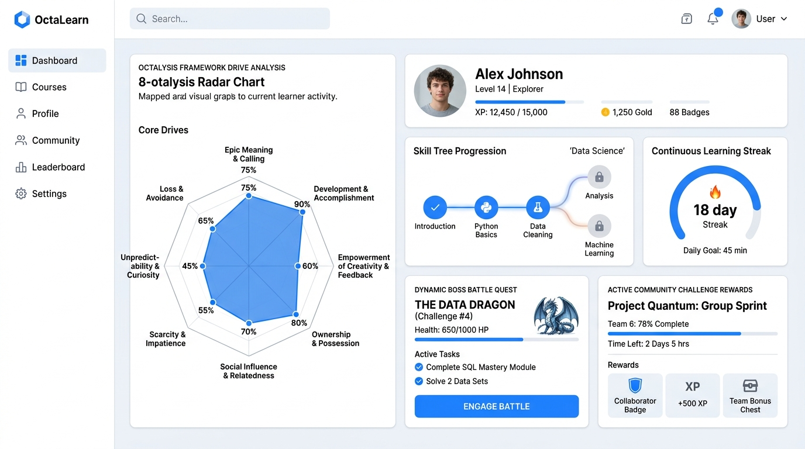

StartKiter 將 Yu-kai Chou 的 **Octalysis 8 大核心驅動力** 完整映射至課程底層功能：

| 八角核心驅動力 (Core Drive) | 遊戲化心理機制 | StartKiter 課程引擎具體實現功能 |
| :--- | :--- | :--- |
| **1. 重使命與召喚 (Epic Meaning)** | 讓學員覺得在執行超越上課的偉大任務 | **任務情境戰役化**：不是教「寫 API」，而是「拯救伺服器崩潰危機」；不是背法規，而是「贏得跨國商務官司」。 |
| **2. 進度與成就感 (Accomplishment)** | 能力可視化成長與打擊感 | **動作打擊感反饋**：毫秒級判定、金光粒子炸裂、COMBO 連擊計量表、+250 XP 與技能樹解鎖。 |
| **3. 賦予創造力與回饋 (Creativity)** | 動手實驗並即時看到成果 | **實體沙盒 + 地圖編輯器 (Level Editor)**：學生自己調參數，還能自製 MOD 關卡給同學挑戰。 |
| **4. 所有權與擁有感 (Ownership)** | 累積專屬資產與作品 | **個人戰利品庫**：每過一關累積真實可跑的專案代碼、專屬稱號勳章與個人自訂虛擬形象。 |
| **5. 社交影響力 (Social Influence)** | 同儕激勵、合作與良性競爭 | **MOD 創意工坊 + 團隊副本**：學生自製關卡由同儕評 5 星、團隊協力挑戰 Boss 副本。 |
| **6. 稀缺性與渴望 (Scarcity)** | 限制激發強烈爭取慾 | **魔王門禁 (Boss Gate)**：沙盒拿到 3 顆星解鎖隱藏支線；每週限時開放高難度挑戰任務。 |
| **7. 未知性與好奇心 (Curiosity)** | 保持探索慾與新鮮感 | **AI 漫劇動態渲染**：卡關提問時，AI 動態生成完全不同的 4 格動漫短片；隨機掉落彩蛋題目。 |
| **8. 損失與避免 (Loss Avoidance)** | 害怕失去累積成果 | **連續學習火焰 (Streak Protection)**：維持 18 天打卡熱度；卡關 3 次 AI 主動給階梯救援防挫折。 |

---

## 3. 4 大課程玩法原型（開放式遊戲架構）

課程引擎不預設單一美術風格或玩法，而是提供 4 種可自由切換的原型：

### 原型 1：動作過關型 (Skill Action)
- **代表學科**：程式開發、音樂樂理節奏、外語跟讀、打字盲打、手術縫合模擬。
- **核心機制**：毫秒級輸入反應、操作精準度、連續 COMBO、物理打擊音效、勝負結算。
- **畫面與音效**：電競街機風、極簡科技風；配清脆機械按鍵音、水晶通關音 (Victory Fanfare)。
- **實機畫面**：
  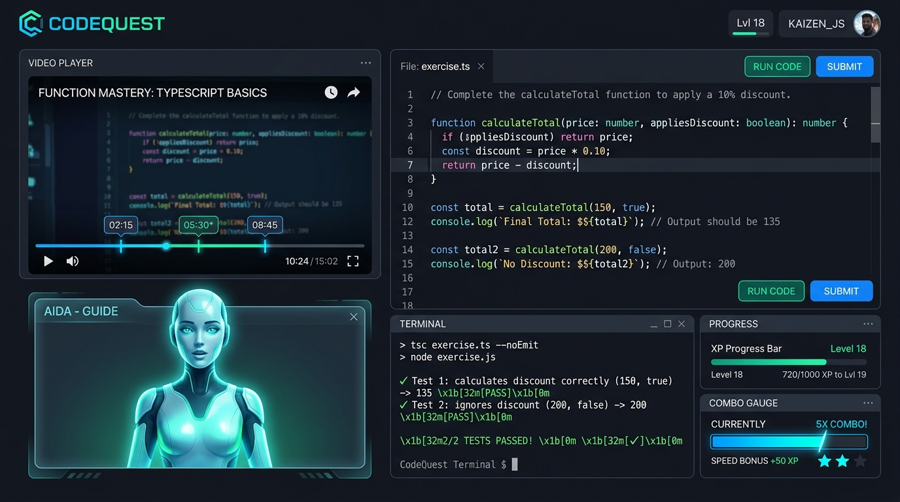
  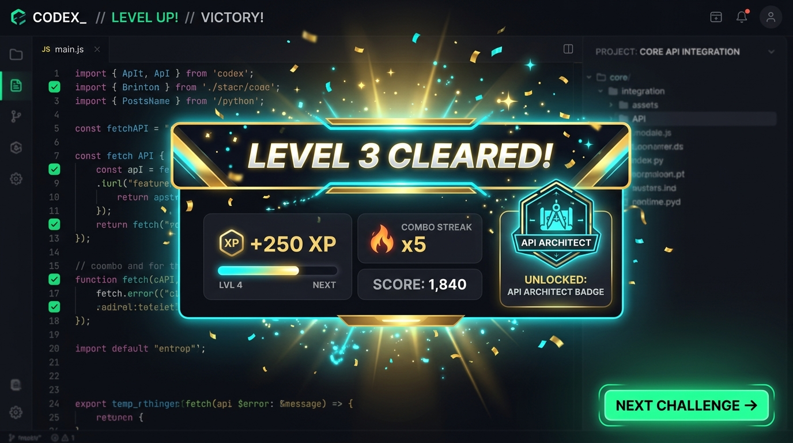

### 原型 2：文本敘事 / 偵探推理型 (Visual Novel / Detective RPG)
- **代表學科**：醫學病症問診、法律合規案件、商務談判、心理諮商。
- **核心機制**：多分支對話樹、線索筆記本、**紅線因果推理軟木板 (Detective Board)**、NPC 緊張度指針。
- **畫面與音效**：復古牛皮紙懸疑風、沉穩商務會議風；配翻書聲、病房環境氛圍音、破案提示音。
- **實機畫面**：
  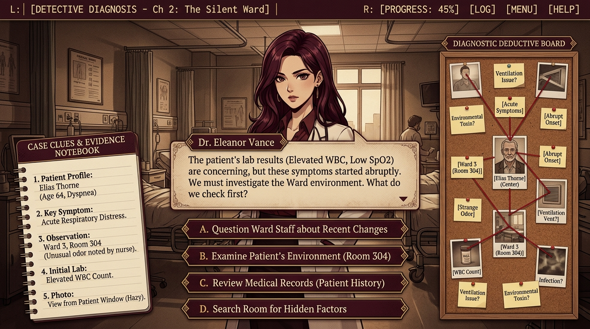
  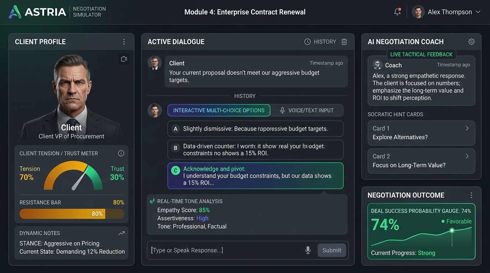

### 原型 3：經營模擬 / 實驗沙盒型 (Simulation & Sandbox Lab)
- **代表學科**：商業定價與現金流模擬、股市投資策略、物理/化學/電路實驗室。
- **核心機制**：**多變數連動滑桿**、即時供需曲線、盈虧淨利潤動態平衡、市場極限壓測。
- **畫面與音效**：北歐極簡藍圖風、數據儀表板風；配清爽滑塊音、數據波動氣泡音。
- **實機畫面**：
  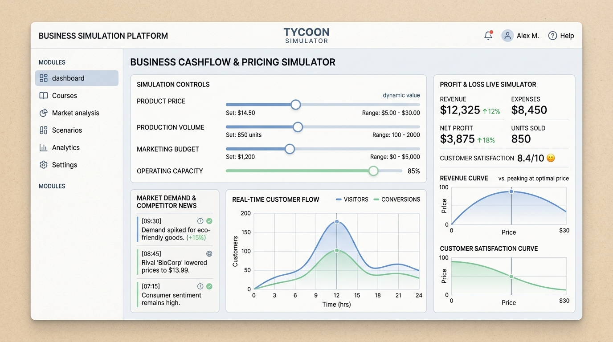
  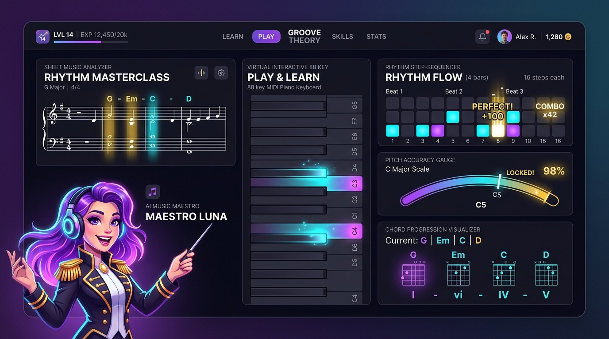

### 原型 4：策略佈局 / 流程解謎型 (Strategy & Puzzle)
- **代表學科**：專案甘特圖排程、軟體架構設計、卡牌決策、演算法步驟排序。
- **核心機制**：有限資源調配、拓撲排序防死鎖驗證、卡牌組合與最佳路徑探索。
- **畫面與音效**：桌遊卡牌風、白板架構風；配抽牌音、齒輪嚙合聲。

---

## 4. AI 漫劇動態渲染管線（無人介入自動迭代）

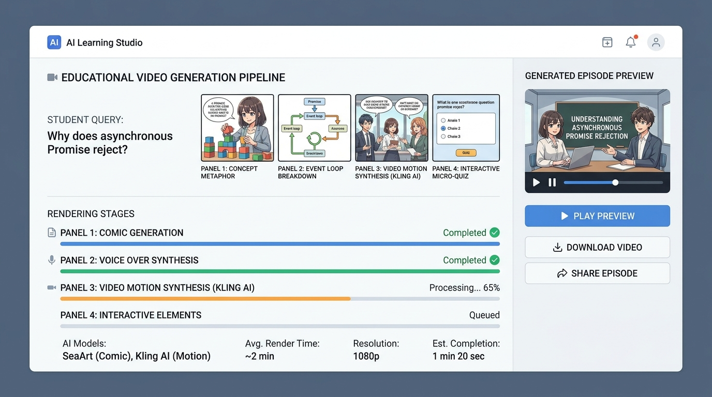

### 4.1 解決傳統課程最大痛點
- **傳統問題**：只要影片某個秒數講不清楚，老師就必須花數小時架設設備重錄整支影片。
- **引擎解法**：學員一旦提問或在特定秒數卡關，系統自動啟動 **AI 漫劇生成管線（SeaArt + 可靈 Kling AI）**，在 2 分鐘內生成 30 秒專屬動漫短片補丁，動態插進影片時間軸！

### 4.2 4 格分鏡動態渲染流程
1. **提問解析與腳本分鏡**：AI 將學員疑問拆解為「格 1：概念比喻」、「格 2：底層機制拆解」、「格 3：動態影片合成」、「格 4：隨堂小測驗」。
2. **角色一致性生成**：調用 SeaArt / Stable Diffusion 保持講師/NPC 形象一致。
3. **動態影片合成**：調用可靈 (Kling AI) 讓動漫講師開口說話、動態演示操作。
4. **無人自動熱修補 (Auto-Patch)**：生成的動漫短片自動封裝為「支線積木」，推送給後續學員，越多人學課程越聰明！

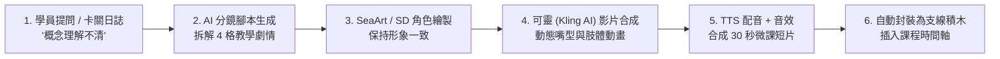

---

## 5. 課程地圖編輯器與社群 MOD 創意工坊 (UGC)

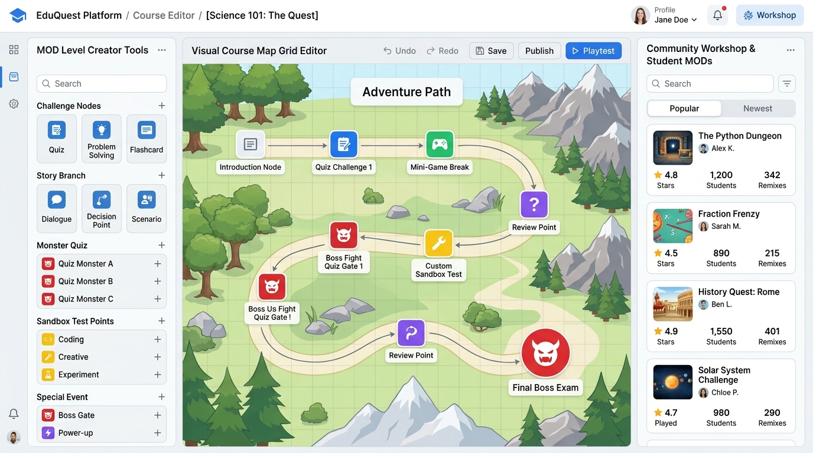

### 5.1 類似瑪利歐創作家 / 魔獸爭霸地圖編輯器
- **官方主線戰役 (Official Campaign)**：老師設計的核心主線課程。
- **課程地圖編輯器 (Level Editor)**：提供學員與助教視覺化拖曳工具，自由在冒險路徑上擺放**挑戰節點、魔王測驗關卡 (Boss Gate)、自訂沙盒測試點**。
- **社群 MOD 創意工坊 (Community Workshop)**：
  - 學生自製關卡發布至創意工坊，同儕互相遊玩、評 5 星好評、Remix 改編。
  - **官方收編機制**：表現極佳的學生自製關卡，老師可一鍵收編為官方主線的 DLC 支線任務。

### 5.2 業界先例與可行性佐證
- **CodeCombat Level Editor**：全球最大開源程式教育遊戲，全平台關卡由社群「Artisans」玩家自主搭建。
- **Roblox Studio**：UGC 遊戲化教育第一品牌，90% 內容由社群玩家自主創造與迭代。

---

## 6. AI 語言模型在系統中的精準角色定位

AI（Claude Code、Codex、GPT-4o、Gemini 等）在課程引擎中承擔三項分工：

```
                    ┌────────────────────────┐
                    │     AI 語言模型核心     │
                    └───────────┬────────────┘
         ┌──────────────────────┼──────────────────────┐
         ▼                      ▼                      ▼
┌──────────────────┐  ┌──────────────────┐  ┌──────────────────┐
│  學生端：隨身教練  │  │  系統端：客觀裁判  │  │  老師端：備課工廠  │
│  (Socratic Coach)│  │ (Autonomous Judge│  │ (Curriculum Bot) │
├──────────────────┤  ├──────────────────┤  ├──────────────────┤
│• 監控沙盒動作    │  │• 0.3秒語氣分析   │  │• 一鍵生成整課教案│
│• 階梯提示不給答案│  │• NPC情緒抗拒指針 │  │• 自動寫測試腳本  │
│• 蘇格拉底追問引導│  │• 判斷同理心與邏輯│  │• 全班卡關熱點遙測│
└──────────────────┘  └──────────────────┘  └──────────────────┘
```

1. **對學員（隨身教練 Coach）**：**主要引導，但不給答案**。學員卡關時啟動三階梯提示（L1 盲點提示 → L2 範例對比 → L3 蘇格拉底對話診斷）。
2. **對系統（客觀裁判 Judge）**：在商務談判或問答中，AI 在 0.3 秒內分析同理心與邏輯，動態改變 NPC 的緊張度與成交機率。
3. **對老師（備課工廠 Copilot）**：老師給主題，AI 自動產出完整教案、實作沙盒題與自動測試腳本。

---

## 7. 全系統工作架構與雙核心流程圖

### 7.1 學生端實戰闖關管線

```mermaid
flowchart TD
    Start([學生打開課程關卡]) --> ViewLesson[1. 閱讀觀念 / 觀看時間軸同步影片]
    ViewLesson --> SandboxAction[2. 在瀏覽器實體沙盒中動手操作]
    SandboxAction --> RunTrigger{點擊「執行驗證」}
    
    RunTrigger --> JudgeCore[3. 瀏覽器微核心 120ms 自動判定<br/>(Vitest / 音準比對 / 語氣分析)]
    
    JudgeCore --> ResultCheck{判定結果}
    
    ResultCheck -- 通過 (Exit 0 / 達標) --> HitFeedback[4. 動作遊戲「打擊感反饋」<br/>💥 音效 + 粒子光效 + COMBO + 經驗值]
    HitFeedback --> ServerProgress[5. 伺服器防偽簽名進度上報]
    ServerProgress --> EndSuccess([🎉 順利通關解鎖下一關])
    
    ResultCheck -- 失敗 (出錯 / 卡關) --> AutoComicPipeline[4. 觸發 AI 漫劇動態渲染管線<br/>(SeaArt / 可靈 生成 30 秒專屬補丁微課)]
    AutoComicPipeline --> WatchComic[學員觀看動漫微課釐清觀念]
    WatchComic --> SandboxAction
```

### 7.2 全系統模組組裝架構圖

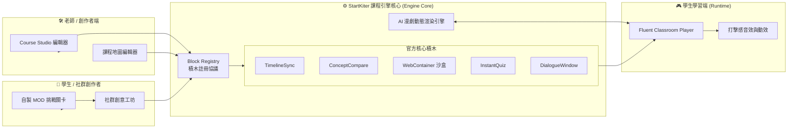

---

## 8. H5P 深度架構借鑑與 WebContainer 評分管線

### 8.1 H5P 核心精髓：Schema 驅動表單與組件註冊
- H5P 最成功的設計是 `semantics.json`（宣告式 Schema）：
  - 自動生成後台 Editor Form，老師零寫表單代碼。
  - 存檔與渲染自動校驗型別與邊界。
- **StartKiter 現代化改造**：採用 **TypeScript + Zod Schema Registry** 替代 H5P 老舊的 JSON 格式，同時享受強型別檢查與現代 React 效能。

### 8.2 WebContainer 瀏覽器微核心評分管線
- 採用 **StackBlitz TutorialKit** 架構：
  - 在學員瀏覽器內啟動 Wasm Node.js 執行緒，掛載虛擬檔案系統 (VFS)。
  - 背景執行 `vitest run --reporter=json`，120ms 內產出結構化測試結果。
  - **平台 0 伺服器運算成本**。

---

## 9. 工程落地具體切片與 7 積木演進路線圖

### 9.1 現有 7 積木升級決策
**保留 7 大核心語彙，升級為 Zod Schema 註冊表**：

| 原生積木名稱 | 建議動作 | 升級方向 |
| :--- | :--- | :--- |
| **`TimelineSync`** | 保留 | 升級為標準時間軸事件匯流排（支援動態掛載 AI 漫劇補丁） |
| **`ConceptCompare`** | 保留 | 升級為 Zod Schema 驅動對比視圖 |
| **`MicroSandbox`** | 保留 + 分流 | 原版保留做輕量參數實驗；新增 **`WebContainerSandbox`（全功能 Node.js 版）** |
| **`WorkflowSorter`** | 保留 | 升級為拓撲排序與死鎖自動驗證 |
| **`InstantQuiz`** | 保留 | 整合打擊感音效與連擊倍率計算 |
| **`TeacherAvatar`** | 保留 | 支援 Live2D / 動漫角色切換與嘴型同步 |
| **`DialogueWindow`** | 保留 | 升級為 Ink 狀態機驅動的動態多分支對話樹 |

### 9.2 後續 SR 拆解規劃
1. **SR-A2（積木架構升級）**：建立 `Block Protocol & Zod Schema Registry`，實現 Studio 編輯器表單自動生成。
2. **SR-B（遊戲化學生端）**：整合 `WebContainer Sandbox`、動作遊戲打擊感音效動效與 Octalysis 八角雷達儀表板。
3. **SR-C（AI 漫劇動態渲染管線）**：串接 SeaArt / 可靈 Kling API，實現學員卡關提問自動生成 30 秒動漫微課補丁。
4. **SR-D（課程地圖編輯器與 MOD 工坊）**：打造視覺化冒險地圖編輯器，開放學生 UGC 關卡創建與社群評分。

---

*規格書版本：2.0.0 | 產出日期：2026-08-23 | 狀態：Approved for SR Decomposition*
