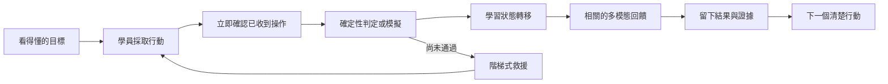

# StartKiter 課程引擎「學習體感」研究與領域定義（工作稿）

> 文件定位：供 StartKiter 內部開發夥伴與 AI 對焦下一代課程系統。
>
> 狀態：研究假說，尚未成為產品名稱、正式架構或 Spectra SR。
>
> 產品事實：課程引擎目前尚未開發、尚未定名。本文不代表任何功能已完成。

---

## 0. 一句話結論

StartKiter 要做的不是「替 LMS 加上遊戲動畫」，而是把 LMS 降到幕後，建立一套能讓學員透過操作、阻力、即時回饋、救援與真實成果，感覺自己真的正在學會一件事的課程體驗引擎。

更精準地說：

> **學習體感（Learning Feel）**是使用者感受到的品質；
> **體驗運行層（Experience Runtime）**是產生這種品質的系統；
> **行動—回饋—結果迴路（Action–Feedback–Consequence Loop）**是可以被設計與驗收的核心機制。

「Learning Game Feel」適合保留為研究來源與類比，但不建議直接當正式架構名稱。

---

## 1. 問題不是影片畫質，而是學員沒有「碰到」知識

傳統 LMS 的主要模型仍是：

```text
老師上傳內容
    ↓
學員觀看影片或閱讀文字
    ↓
回答測驗
    ↓
系統記錄完成
```

視覺與聽覺可以不斷升級：更好的攝影機、燈光、動畫、配樂與剪輯。但不論是 1080p、4K 或多機拍攝，只要學員仍然只能觀看，底層關係就沒有改變。

真正缺少的是：

```text
我做了一件事
    ↓
系統理解我做了什麼
    ↓
世界產生可感知的變化
    ↓
我知道自己為什麼成功或失敗
    ↓
這個結果影響下一步
```

本文把這種「知識不再只是被觀看，而是可以被操作、測試與感受」的品質，暫稱為**學習體感**。

---

## 2. 4DX、豪華影廳與 3A 遊戲的類比，分別代表什麼

三個類比不能混成「更多聲光效果」，它們分別對應不同的設計能力。

| 類比 | 真正價值 | 映射到課程引擎 |
|---|---|---|
| 4DX 座椅 | 畫面事件與身體回饋同步 | 學員操作後，介面、聲音、動畫與狀態立即產生相關反應 |
| 豪華影廳 | 降低摩擦，讓人舒服地進入體驗 | 免安裝、可續接、節奏可調、失敗不羞辱、卡住有人接住 |
| 3A 遊戲 | 世界規則一致、選擇有後果、操作有重量 | 課程中的任務、判定、提示、進度與成果遵循同一套可信規則 |

因此，「3A 級課程」不等於每門課都要有 3D 大世界、電影級角色或昂貴動畫。

**3A 是體驗品質標準，不是資產數量標準。**

第一版若直接追求大量 3D、美術與劇情，會退化成昂貴的客製遊戲專案。StartKiter 應先打造能反覆產生高品質體感的引擎與創作工具。

---

## 3. 為什麼「學習體感層（Learning Game Feel）」還不夠精準

### 3.1 它說中了什麼

- 「體感」比「互動」更接近目標，因為點擊按鈕不一定有體感。
- 「Game Feel」指出即時控制、回饋與結果之間的關係，而不是點數、徽章與排行榜。
- 它能提醒開發團隊：效果的價值來自與事件同步，不是裝飾。

### 3.2 它容易讓人誤會什麼

- 「觸覺」容易被理解為手機震動、控制器或 VR 硬體。
- 「遊戲」容易讓人先想到 Boss、XP、動漫換皮與刺激成癮。
- 「層」容易讓工程團隊誤以為可以建立一個獨立 package，裝上後就自動產生體感。

實際上，體感是由操作介面、判定器、狀態機、回饋、救援、成果保存與教學策略共同產生的**跨系統品質**。

就像資安不是一個按鈕、效能不是一個元件，學習體感也不是單一功能。

---

## 4. 建議採用三層術語，而不是強迫一個詞做三件事

| 用途 | 建議暫定詞 | 定義 |
|---|---|---|
| 對人描述感受 | **學習體感（Learning Feel）** | 學員覺得自己的操作被理解、努力有重量、進展真實存在 |
| 對工程描述系統 | **體驗運行層（Experience Runtime）** | 接收動作、執行判定、轉移狀態、產生回饋並保存證據的運行系統 |
| 對驗收描述機制 | **行動—回饋—結果迴路（AFC Loop）** | 每個學習行動都能被判定、回應，並產生可理解的後果 |

### 不建議直接採用的名稱

| 名稱 | 問題 |
|---|---|
| 沉浸式學習 | 容易被理解成 VR、動畫或專注感，沒有說明操作與結果 |
| 遊戲化學習 | 市場常把它等同點數、徽章、排行榜與連續登入 |
| 體驗式學習 | 已有既定教育理論語境，容易與實習、實作課混淆 |
| 互動學習層 | 太寬鬆，點一下選單也可以叫互動 |
| 數位觸覺層 | 太靠近硬體與感官技術，無法涵蓋情緒、救援與成果感 |

### 本文件的暫定用法

- 願景討論使用「學習體感」。
- 系統架構使用「體驗運行層」。
- 任務與測試使用「AFC Loop」。
- 「Learning Game Feel」保留在研究備註，不先定為產品正式名稱。

---

## 5. 學習體感的五個構成面

### 5.1 主動感（Agency）

學員必須能做出有意義的選擇，而不是照著唯一答案點「下一步」。選擇應改變系統狀態、解法、資源或後續路線。

反例：不論選哪個答案，都播放相同動畫並給相同結果。

### 5.2 阻力感（Meaningful Resistance）

知識必須對學員產生適當阻力。太簡單沒有成就，太困難只會退出。阻力來自真實約束、錯誤狀態、資源限制與判斷，不是故意增加操作步驟。

反例：為了「像遊戲」而要求重複點擊、等待或蒐集無意義道具。

### 5.3 回饋感（Responsive Feedback）

系統必須快速說明「剛才發生了什麼」。視覺、聲音、震動與動畫只是媒介；回饋必須與學員的行動及判定結果有因果關係。

反例：回答錯誤仍然播放大量粒子效果，卻沒有指出錯在哪裡。

### 5.4 結果感（Consequence & Ownership）

完成任務後應留下可保存、可繼續使用、可展示或可被市場驗證的成果。學習結果不只是一個百分比。

對 AI SaaS 課程而言，結果可以是 repo、測試紀錄、部署網址、付款流程、訪談證據與第一筆交易。

反例：完成十個單元只得到徽章，沒有任何能帶走的作品或能力證據。

### 5.5 被接住的感覺（Supported Struggle）

高品質體感不只是刺激，也包含安全與舒適。學員應知道自己可以失敗、可以復原，而且求助不會直接奪走控制權。

反例：AI 一看到錯誤就貼出完整答案；或只顯示紅字「錯誤」後讓學員自己離開。

---

## 6. 核心模型：行動—回饋—結果迴路（AFC Loop）



### 一個完整 AFC Loop 必須回答

| 欄位 | 必須說清楚的內容 |
|---|---|
| Goal | 學員現在要完成什麼，為什麼值得做 |
| Action Surface | 學員實際操作什麼，不只是觀看什麼 |
| Evaluator | 系統如何知道做對、做錯或做到什麼程度 |
| Feedback Map | 不同結果要用什麼方式回應，回應如何解釋因果 |
| Consequence | 結果如何影響進度、作品、路線或真實世界 |
| Recovery | 失敗後如何提示、重試、退階或找老師 |
| Evidence | 系統保存哪些可驗證證據，而不是只存完成百分比 |

### 建議的課程任務資料契約（概念稿）

```yaml
mission:
  goal: "讓測試付款能建立訂單，且偽造 webhook 會被拒絕"
  action_surface: "程式編輯器 + 測試付款控制台"
  evaluator:
    deterministic_tests:
      - "有效簽名建立一筆訂單"
      - "錯誤簽名回傳 401"
      - "重送事件不建立重複訂單"
  feedback:
    acknowledged: "立即顯示事件已送達"
    passed: "呈現資料流完成與訂單證據"
    failed: "標出失敗邊界，不直接給答案"
  recovery:
    level_1: "指出檢查範圍"
    level_2: "比較正確與錯誤資料流"
    level_3: "由 AI 教練逐步追問"
  consequence:
    unlocks: "定價與正式付款任務"
    artifact: "付款流程驗證報告"
```

這份契約的重點不是 YAML，而是強迫每個課程活動都有完整因果迴路。

---

## 7. AI SaaS 課程中的具體體感範例

### 任務：讓第一位測試客戶完成付款

#### 傳統 LMS 版本

1. 看老師示範付款 API。
2. 下載範例代碼。
3. 回答三題選擇題。
4. 按下完成。

#### 體驗引擎版本

```text
收到一張「客戶已決定購買，但付款失敗」的任務卡
    ↓
學員在隔離環境接上測試付款
    ↓
系統送出成功、失敗、偽造與重複 webhook
    ↓
資料流在畫面上逐站亮起，失敗停在真正的邊界
    ↓
學員修正後重新執行
    ↓
訂單、權限與收據全部通過
    ↓
產生可帶走的驗證報告，解鎖定價實驗
```

這裡的「觸覺」不依賴震動。學員會感覺到：

- 自己的代碼真的改變付款結果。
- 錯誤不是抽象紅字，而是資料流在某個位置斷掉。
- 修正後，先前失敗的路徑真正被打通。
- 完成後留下可展示、可重跑的商業能力證據。

### 老師端的回流

如果 40% 學員都卡在簽名驗證，系統不應自行把 AI 生成內容直接發布。正確流程是：

```text
共同卡點被偵測
    ↓
系統整理錯誤群與代表案例
    ↓
AI 提出補救積木或微課候選
    ↓
老師審核、修改與發布
    ↓
後續學員走新版本，成效再被比較
```

這才是「課程自我進化」：以證據協助老師改課，不是 AI 無人監督地自動改教材。

---

## 8. 老師端也需要創作體感，但它不是學習體感

兩者應分開定義。

| 體感 | 使用者 | 目標 |
|---|---|---|
| 學習體感 | 學員 | 操作知識、承受阻力、取得回饋、留下成果 |
| 創作體感 | 老師／教練 | 將經驗快速編排成可測試、可預覽、可迭代的任務 |

老師端的理想迴路：

```text
選擇教學意圖
    ↓
放入體驗積木
    ↓
填寫目標、判定與救援規則
    ↓
立即以學員身分試玩
    ↓
查看真實卡點與成果證據
    ↓
調整後重新發布
```

H5P 的 `semantics.json` 證明 Schema 可以同時驅動編輯表單與內容校驗；StartKiter 可以借鑑這個原理，使用現代 TypeScript／Zod 契約建立 Course Studio，而不是照搬 H5P 的舊技術棧。[H5P Semantics Definition](https://h5p.org/semantics)

---

## 9. 研究證據對產品方向的影響

### 9.1 主動學習有效，但體驗可能更辛苦

2014 年 PNAS 統合分析顯示，主動學習組的考試表現平均提高約 6%，傳統講課組失敗機率約高 1.5 倍。[Active learning increases student performance](https://www.pnas.org/doi/10.1073/pnas.1319030111)

2019 年 PNAS 實驗同時發現，主動學習者可能「實際學得更多，主觀上卻覺得學得更少」，部分原因是更高的認知努力。[Measuring actual learning versus feeling of learning](https://www.pnas.org/doi/10.1073/pnas.1821936116)

**產品含義**：引擎不能只增加操作量；它必須讓努力、進步、失敗原因與下一步變得可感知。

### 9.2 更多特效不等於更好的 Game Feel

一項 1,699 人的預註冊遊戲實驗指出，好奇心是享受與自由遊玩時間的重要預測因子；單純放大回饋反而可能削弱動機，原因之一是傷害玩家的自主感。[How does Juicy Game Feedback Motivate?](https://experts.illinois.edu/en/publications/how-does-juicy-game-feedback-motivate-testing-curiosity-competenc/)

**產品含義**：粒子、音效與震動必須對應真實行動和結果。沒有控制感的特效只是噪音。

### 9.3 實體觸覺有價值，但不是通用答案

2025 年 XR 觸覺統合分析納入 25 項研究，發現概念學習與使用體驗有正向效果，但操作表現未達顯著改善。[The Role of Haptic Interaction in Embodied XR Learning](https://link.springer.com/article/10.1007/s10648-025-10072-w)

2026 年一項 87 人研究未發現實體觸覺材料帶來整體學習成果差異，但在部分情境改善認知負荷與內在動機，且效果受個人的觸覺需求差異影響。[Feel it to learn it](https://pmc.ncbi.nlm.nih.gov/articles/PMC13007604/)

瀏覽器的 Vibration API 與 Gamepad Haptic API 也都屬有限支援，不能成為核心課程成立的必要條件。[MDN Vibration API](https://developer.mozilla.org/en-US/docs/Web/API/Vibration_API)、[MDN GamepadHapticActuator](https://developer.mozilla.org/en-US/docs/Web/API/GamepadHapticActuator)

**產品含義**：硬體觸覺是可選 Experience Pack；核心學習體感必須在沒有震動、控制器與 VR 的裝置上仍然成立。

### 9.4 AI 應放大老師，不應取代教學責任

Stanford SCALE 對 AI tutoring 的整理認為，目前研究更支持 AI 協助提高真人 tutor 的效能與容量，而不是直接取代高品質真人教學。這個研究情境與成人 SaaS 課不同，但其角色邊界可供參考。[AI Tutoring is Not a Monolith](https://scale.stanford.edu/research-in-action/ai-tutoring-not-monolith)

**產品含義**：確定性測試負責裁判，狀態機負責教學邊界，AI 負責解釋、追問、個人化與候選內容；正式課程變更由老師核准。

---

## 10. 市場並非空白，缺口在「通用且可創作的整合引擎」

| 市場切片 | 代表產品 | 已做到 | 仍未解決的部分 |
|---|---|---|---|
| 影片互動 | [LearnWorlds](https://www.learnworlds.com/product/features/interactive-video/) | 影片內提問、摘要、互動節點 | 核心仍是影片時間軸 |
| 視覺適性練習 | [Brilliant](https://brilliant.org/) | 邊做邊學、視覺引導、個人化練習 | 封閉內容系統，不是通用老師引擎 |
| 程式實作 | [Scrimba](https://scrimba.com/)、[TutorialKit](https://tutorialkit.dev/guides/about/) | 即時編輯、預覽、Terminal、代碼挑戰 | 主要集中軟體開發領域 |
| 遊戲化學習 | [Boot.dev](https://www.boot.dev/)、[Genially](https://genially.com/features/gamification/) | RPG 路徑、AI 提示、互動模板 | 前者封閉，後者偏內容模板 |
| 模擬與角色扮演 | [Labster](https://www.labster.com/)、[Virti](https://www.virti.com/ai-role-play-platform/) | 虛擬實驗、AI 對話與安全演練 | 垂直領域明確，客製成本較高 |

因此，不應宣稱「市場上沒有人做互動或體感」。較準確的產品假說是：

> 市場已有許多垂直體驗，但仍缺少一套讓一般老師不依賴工程團隊，也能編排跨領域 AFC Loop、接入 AI、判定真實成果並持續迭代的開放課程引擎。

這項缺口仍需後續訪談老師、企業培訓團隊與互動課程製作者驗證，不能只靠競品頁面下定論。

---

## 11. 體驗運行層的建議邊界

```text
StartKiter Platform Shell
├── Identity／Auth
├── Commerce／Orders／Access
├── Community／Support
│
└── Course System
    ├── Course Studio
    │   └── 老師編排、預覽、發布與分析
    │
    ├── Experience Runtime
    │   ├── Action Surface
    │   ├── Deterministic Evaluator
    │   ├── Learning State Engine
    │   ├── Feedback Orchestrator
    │   ├── Recovery／Hint Ladder
    │   └── Evidence／Telemetry
    │
    ├── AI Pedagogy Adapter
    │   └── 受狀態與老師規則限制的 AI 教練
    │
    └── Experience Packs
        └── 視覺、聲音、動畫、震動、角色與世界觀
```

### 邊界原則

- LMS 的帳號、購買、權限與行政能力不必消失，但應退到後勤。
- Experience Pack 只能改變呈現，不可偷偷改變判定與商業規則。
- AI 不擔任可用測試明確判定之任務的唯一裁判。
- 每個 Runtime 積木必須能產生標準事件與證據。
- 學習體感是整體品質，不建立一個名為 `learning-game-feel` 的空殼 package。

---

## 12. 第一版應驗證什麼

第一版不需要證明能做所有學科，也不需要證明能做 3A 美術。它只需要證明一件事：

> 同一個課程任務，在 Experience Runtime 中，是否比「影片＋測驗」更能讓學員理解自己的行動、錯誤、進步與真實成果。

### 建議選擇一條 AI SaaS 黃金路徑

```text
辨識真實問題
    ↓
做出可操作原型
    ↓
完成登入與資料保存
    ↓
部署公開網址
    ↓
接上測試付款
    ↓
取得第一輪使用者證據
```

每個階段只先做一個高品質 AFC Loop。先驗證學習體感，再擴張積木數量、課程類型、UGC 與 Marketplace。

### 初期非目標

- 不做每門課專屬的 3D 開放世界。
- 不把 Octalysis 八角雷達當成產品核心。
- 不以 XP、徽章、排行榜或連續登入代替學習成果。
- 不讓 AI 自動把生成教材直接發布給所有學員。
- 不把控制器震動、VR 或特定瀏覽器能力設為必備條件。

---

## 13. 可驗收的體感品質假說

以下數字是待測產品假說，不是已證實規格。

| 品質 | 第一版假說 |
|---|---|
| 操作確認 | 點擊、拖曳、輸入等操作在 100ms 內得到視覺確認 |
| 本地判定 | 能在本機完成的確定性判定，目標 500ms 內回應 |
| 遠端等待 | 超過 1 秒的工作必須顯示正在做什麼，不留下無反應空白 |
| 錯誤理解 | 失敗回饋指出失敗邊界與下一個可採取行動，不只顯示「錯誤」 |
| 救援控制 | 提示分級，由學員選擇是否升級，不強制奪走解題權 |
| 結果保存 | 通關後留下可重跑、可展示或可繼續使用的成果證據 |
| 無障礙 | 動畫、聲音與震動可降低或關閉；關閉後仍能完整學習 |

真正的驗收仍需找學員觀察，不能只看工程延遲數字。

建議觀察：

- 學員能否說出現在的目標與下一個動作。
- 學員失敗後是否知道該改哪個範圍。
- 提示是否讓學員重新取得控制，而非依賴答案。
- 完成後是否能指出自己留下的真實成果。
- 老師能否從遙測資料找到可行的課程改善點。

---

## 14. 最大風險與防線

| 風險 | 會發生什麼 | 防線 |
|---|---|---|
| 3A 誤讀 | 團隊先做美術、劇情與 3D，沒有可重用引擎 | 先驗證 AFC Loop，再做 Experience Pack |
| 刺激取代學習 | 動畫與獎勵很多，學員沒有能力成長 | 回饋必須綁定判定與真實結果 |
| AI 成為黑箱裁判 | 評分不一致，學員無法申訴或重現 | 確定性測試優先；AI 評分需 rubric、證據與覆核 |
| 內容成本爆炸 | 每個老師仍需要工程師客製 | Schema 驅動 Studio、可重用積木與範本 |
| 過度監控 | 遙測傷害信任與隱私 | 只收教學必要事件，清楚揭露並限制用途 |

---

## 15. 與現有文件的關係

- [`startkiter-course-engine-research.md`](./startkiter-course-engine-research.md)：技術與競品研究來源，涵蓋 H5P、WebContainer、狀態機與 AI Provider。
- [`course-engine-architecture-gameplay-spec.md`](./course-engine-architecture-gameplay-spec.md)：較早的遊戲化產品構想，包含 Octalysis、AI 漫劇與 MOD 工坊。
- [`startkiter-development-sop.md`](./startkiter-development-sop.md)：未來進入正式開發後應遵循的 SDD、TDD、Review 與 E2E 流程。

依目前產品事實，`course-engine-architecture-gameplay-spec.md` 中的「SSOT」「Approved for SR Decomposition」「實機畫面」等字樣，應視為尚待重新確認的舊稿標記，不能作為功能已定案或已完成的證據。本文不直接修改該檔案。

正式決策順序建議為：

```text
確認領域概念與術語
    ↓
選一條 AI SaaS 黃金路徑
    ↓
製作一個可操作體感原型
    ↓
找老師、學員與開發夥伴觀察
    ↓
根據證據撰寫 Spectra proposal／design／tasks
```

---

## 16. 本輪暫定結論

1. 「觸覺」是願景來源，但正式定義不能依賴硬體震動。
2. 「學習體感」可暫時作為人話概念，描述學員主觀感受到的品質。
3. 「Learning Game Feel」適合當設計類比，不建議直接當產品或 package 名稱。
4. 工程架構暫稱「Experience Runtime」，核心驗收單位為 AFC Loop。
5. 下一步先做一個 AI SaaS 任務的可操作原型，不先建立完整 LMS 或 3A 世界。

---

## 17. 以「案神實戰課」具體定位暫稱「課神」的模組角色

> 本節新增背景：以「教學員使用案神 Awesome-Anson」作為第一個具體課程案例，反推課神在 StartKiter 裡應負責什麼。

### 17.1 先分清楚四個不同角色

```text
課神（暫稱）
通用課程體驗引擎，負責運行規則
        │
        ▼
案神實戰課
使用課神製作的一套課程內容與任務
        │
        ▼
案神 Awesome-Anson
學員要學會操作的真實工具／能力系統
        │
        ▼
老師／教練
定義接案判斷、好壞標準與最終商業裁決
```

用遊戲開發類比：

| 課程世界 | 遊戲開發世界 |
|---|---|
| 課神 | Unreal Engine／Godot |
| 案神實戰課 | 用引擎做出的某一款遊戲 |
| 一個接案任務 | 一個關卡／Quest |
| 案神的 Skills／Agents | 遊戲中的能力、工具與可操作角色 |
| 學員進度與作品證據 | Save Data／成就與玩家資產 |
| 老師的教學規則 | Game Design、關卡設計與裁判規則 |

因此，**課神不是一門課，也不是案神的上層管理者**。它是讓各種課程能被定義、執行、判定、救援與追蹤的通用運行底層。

### 17.2 課神應該負責什麼

| 課神責任 | 在案神實戰課中的例子 |
|---|---|
| 運行任務 | 告訴學員現在要把逐字稿整理成已確認／待確認／我猜的 |
| 接收操作 | 接收學員標記訊號、追問、修改資料包、選擇要委派的 Agent |
| 執行判定 | 檢查資料契約完整、未確認資訊沒有被冒充成事實、交接欄位符合規則 |
| 管理狀態 | 記得學員已完成需求拆解，但報價條款仍缺確認 |
| 產生回饋 | 顯示哪一段推論缺證據、哪個交接會造成後續風險 |
| 提供救援 | 依序給盲點、對比例、蘇格拉底追問，不直接替學員完成 |
| 保存證據 | 保存學員完成的需求資料包、報價判斷、派工決策與成果頁 |
| 回流老師 | 告訴老師多數學員都在哪種訊號或商業判斷上出錯 |

課神不應負責：

- 決定案神應該如何報價或判斷客戶。
- 內建某一套接案方法為所有課程的通用真理。
- 修改案神自己的 Agent、Skill 或業務契約。
- 用 AI 黑箱取代老師對商業品質的最終判斷。
- 自動把所有課程包裝成 RPG、Boss 或動漫風格。

### 17.3 「案神實戰課」應該提供什麼

案神的領域知識不應寫死在課神核心裡，而應由一份可版本化的 **Course Pack（課程包）** 提供。

概念上的 Course Pack 包含：

| 內容 | 案神範例 |
|---|---|
| Learning Outcomes | 能從原始對談走到已確認需求、報價與交付路線 |
| Missions | 訪談拆解、風險辨識、報價、派工、Demo／簡報交付 |
| Domain Fixtures | 經過匿名化的逐字稿、客戶反應、模糊需求與反例 |
| Evaluators | 資料契約檢查、狀態標記檢查、必填欄位、Rubric |
| Recovery Rules | 哪些錯誤先提示範圍，哪些情況需要老師介入 |
| Tool Adapter | 在安全環境呼叫案神能力、取得輸出並轉成標準事件 |
| Experience Pack | 商務顧問工作台的視覺、聲音與情境表現 |

課神讀懂的是這份標準契約，不需要知道「案神」三個字代表什麼。

### 17.4 「module」一詞在 StartKiter 裡有三種意思，必須禁止混用

目前最容易發生的架構混亂，是把所有東西都稱為模組。

| 建議 canonical term | 中文 | 例子 | 所屬層級 |
|---|---|---|---|
| Platform Module | 平台模組 | `course`、`deployment` | StartKiter Shell 掛載的產品能力 |
| Course Pack | 課程包 | `anson-practical-course` | 某一套可發布、可版本化的課程 |
| Mission | 任務 | 從逐字稿產出已確認需求資料包 | 課程中的可驗收關卡 |
| Experience Block | 體驗積木 | 對話重播、訊號標記、決策分支、資料包驗證 | 任務畫面與操作語彙 |
| Tool Adapter | 工具轉接器 | 案神執行轉接器 | 將外部工具輸出轉為 Runtime 標準事件 |

禁止把「案神實戰課」叫成 StartKiter Platform Module，也禁止把一個選擇題積木稱為完整 Course Module。

### 17.5 課神在 StartKiter 既有架構中的位置

StartKiter 現有 `config/modules.ts` 已經把 `course` 註冊為 Platform Module；`packages/course` 也已被定義為 Core 能力。若未來正式立案，建議先沿用這個邊界，不要另建一個平行的 `packages/keshan` 與 `packages/course` 互相競爭。

概念位置如下：

```text
config/modules.ts
└── Platform Module: course
    ├── Public Course／Sales Preview
    ├── Learner Academy
    ├── Course Studio
    │
    └── packages/course（Core）
        ├── Experience Runtime（課神的工程本體）
        ├── Course Pack Loader
        ├── Mission／State Engine
        ├── Evaluator Registry
        ├── Feedback／Recovery Orchestrator
        ├── Evidence／Telemetry
        └── Experience Block Registry

Course Content
└── Course Pack: anson-practical-course
    ├── missions
    ├── fixtures
    ├── evaluators／rubrics
    ├── tool-adapter: awesome-anson
    └── experience-pack
```

這只是領域邊界草圖，不是已核准的目錄與 package 設計。正式路徑仍需經 Spectra proposal／design 決策。

### 17.6 案神實戰課不應教「背指令」，而要教「做出正確商業判斷」

案神 README 的基本操作可以用說明文件教完；它不值得單獨做成體驗引擎。

真正適合課神的，是案神背後需要練習的能力：

```text
讀懂客戶真正說了什麼
    ↓
區分事實、待確認與推測
    ↓
決定下一題該問什麼
    ↓
把需求轉成可報價、可交付的邊界
    ↓
判斷該委派哪個專家，以及何時必須停下來確認
```

如果課程只教：

```text
打開 Claude Code → 輸入 /client-quote → 回答問題 → 下載報價單
```

那仍然只是教學影片加操作手冊，沒有發揮課神的價值。

### 17.7 建議的案神課程主線

| 階段 | 學員要證明的能力 | 體感任務 |
|---|---|---|
| 1. 聽懂案件 | 從雜亂對談抓出人群、場景、痛點與限制 | 對話重播＋訊號標記板 |
| 2. 管理不確定性 | 正確區分已確認、待確認、我猜的 | 證據連線與風險燈號 |
| 3. 收斂需求 | 用下一個好問題補齊會影響報價的缺口 | AI 客戶角色扮演 |
| 4. 做商業決策 | 定義範圍、價格、條款與不承諾事項 | 報價與範圍模擬器 |
| 5. 正確派工 | 依案件情況選擇網頁、案例、簡報、Demo、報價等能力 | 調度決策桌 |
| 6. 交出成果 | 產出符合契約且只含已確認資訊的交接包 | 真實案神執行＋成果驗證 |

最終考驗不使用老師示範過的案例。學員收到一份新的匿名案件資料，必須自己完成拆解、追問、報價理由、派工與交接證據。

### 17.8 一個具體 AFC Loop：把「我猜的」誤當成「已確認」

```text
學員看到客戶說：「預算應該還可以再談。」
    ↓
學員把「預算充足」標成已確認
    ↓
資料契約檢查通過格式，但 Evidence Evaluator 找不到直接證據
    ↓
系統不只顯示紅字，而是模擬後果：報價建立在未確認預算上
    ↓
AI 客戶在下一輪提出：「我沒有說預算沒有上限」
    ↓
學員回到原句，改成待確認並設計下一個追問
    ↓
風險下降，需求資料包留下完整證據鏈
```

這個迴路的體感不是爆炸動畫，而是學員親自感受到「一句沒有證據的推測，會如何污染後續報價」。

### 17.9 判定責任必須分三層

| 判定層 | 適合判斷 | 案神例子 |
|---|---|---|
| Deterministic Evaluator | 格式、欄位、狀態、契約、不變條件 | 未確認資料不可進正式報價交接 |
| AI Rubric Evaluator | 語意品質、追問價值、同理與推理候選評分 | 下一題是否真的能降低商業風險 |
| Human Teacher Review | 高風險、價值判斷、情境裁決 | 這個價格、承諾與合作方式是否合理 |

AI Rubric 的結果必須附理由與引用證據，不能只吐一個分數。涉及正式商業判斷時，老師保留最終裁決。

### 17.10 課神的第一個原型不需要整套案神課

最小原型可以只做一個任務：

> 給學員一段 5–8 分鐘的匿名客戶對談，要求他標記「已確認／待確認／我猜的」，再設計一個能降低最大商業風險的下一題。

這個原型需要：

- 對話重播與文字定位。
- 三態訊號標記與證據連線。
- 一個確定性規則檢查。
- 一個受 Rubric 約束的 AI 客戶回應。
- 一份學員最後能帶走的需求拆解證據包。

它已足以驗證課神最核心的產品假說：**學員是否因為行動、後果與救援，比觀看案神教學影片更能學會真正的接案判斷。**

---

*文件版本：0.1.0 | 更新日期：2026-08-23 | 狀態：Working Draft*
