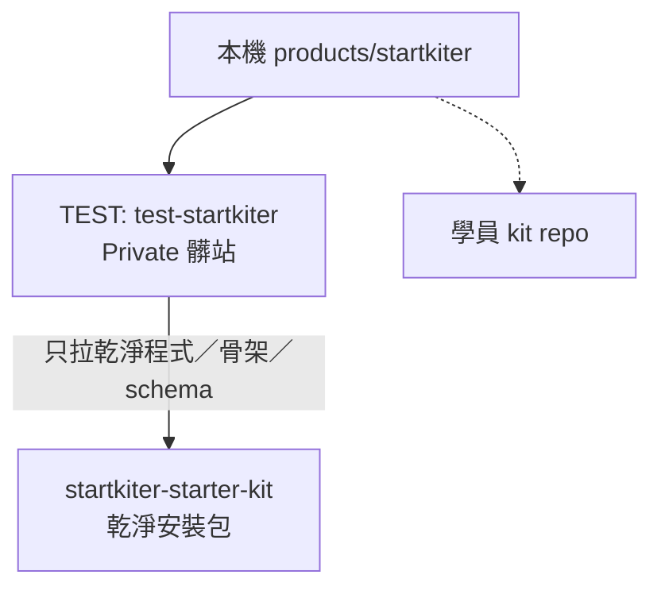

# StartKiter 部署與測試站結構（SSOT 備忘）

這份只做紀錄，不當期功能單。結構對齊日：2026-08-15。

▋ 一句話

邊裝邊測用髒的測試站；測完再複製成乾淨正式站。OAuth／整合測走測試站公網 HTTPS，不走本機 Tunnel。

▋ 三個倉庫／兩層站（不要混）

• 本機開發目錄：`products/startkiter`（Spectra 施工、本機改碼；可同步進 TEST）

• TEST 倉庫：`test-startkiter`（命名規則 `test-<專案名>`）。Private。專門邊裝邊測、托管部署（Vercel／可選 Cloudflare 或 VPS）+ 雲端 DB。會髒：測試帳號、測試圖、安裝雜物、**我們公司自己的 Landing／文章／營運內容**都可以待在這裡。用戶看不到這個倉庫。Git push `test` remote 的 `main` → Vercel 自動部署（已於 2026-08-15 接通 Login Connection；CLI `vercel deploy` 僅作備援）。

• 正式倉庫（乾淨安裝包）：獨立 GitHub 私有倉庫 `fishtvlvoe/startkiter-starter-kit`。從 TEST／本機施工庫把**乾淨的東西拉出來**，對標 `/Users/fishtv/Development/supastarter-nextjs-main` 那種乾淨度——單純安裝包：殼、前端頁面骨架、資料庫 schema／必要 seed。**不要**塞架站維運雜訊、**不要**塞我們公司資訊、**不要**塞 Landing 文章頁這類營運內容。這才是未來給客戶、並持續迭代更新的本體。禁止把 `test-startkiter` 改名或把 TEST 歷史當客戶包。完整 Allow／Forbid 與腳本見 [`docs/clean-package-promotion-guide.md`](./clean-package-promotion-guide.md)。

• 學員終身代碼包：付費後 GitHub App 邀的 kit repo。跟 TEST／正式安裝包都無關。

一句話：TEST＝我們自己邊裝邊修的髒站；正式倉庫＝給客戶的乾淨安裝包（像當初買的 supastarter），不是把髒 repo 改名上線。

▋ 為什麼要分開測／正式

建置過程會堆測試帳號、測試圖、安裝工具、實驗程式。這些不該進正式倉庫與正式 DB。正式上線要像「剛裝好的乾淨殼」，不是開發垃圾場。

▋ 流程（文字）

1. 建 `test-startkiter` → 接 Vercel（與／或 Cloudflare／VPS）→ 接雲端 DB → 設 OAuth callback 到測試站網址。

2. 在測試站把學生會踩的安裝／部署／登入／金流／領 kit 跑一遍，邊修邊推。

3. 確認功能與課綱內容都穩 → 複製成正式 repo／正式網域／乾淨 DB。

4. 本機 `localhost` 仍可開發；對外 OAuth、webhook、真機整合以測試站為準。

▋ 圖解

```text
本機 products/startkiter
        │
        ▼
 GitHub: test-startkiter（Private，用戶看不到）
   髒：測帳號、測圖、公司 Landing／文章、安裝雜物
        │  push → Vercel／可選 CF‧VPS + 雲端 DB
        │
        │  從裡面「只拉乾淨的」出來
        ▼
 GitHub: fishtvlvoe/startkiter-starter-kit（乾淨安裝包）
   有：殼、前端骨架、DB schema
   無：架站雜訊、公司資訊、Landing 文章營運頁
        │
        └── 給客戶／持續迭代的本體

旁支：學員 kit repo（付費履約）── 無關
```



▋ 已廢：Cloudflare Tunnel 當對外測入口

以下為 2026-08-15 早先嘗試，**不再當 OAuth／整合測試主路徑**：

• 曾設：`https://startkiter.aiver.me` → Tunnel → 本機 `127.0.0.1:3000`

• Tunnel ID：`e3a0f3ba-e04d-4633-a52d-f103e8540804`（本機 `~/.cloudflared/startkiter.yml` 仍可能存在，可之後清）

• 誤建過 `startkiter.aiver.me.buygo.me`（buygo zone）；Dashboard 看到可刪

理由：邊裝邊部署需要真實托管環境（Vercel／VPS／CF）與雲端 DB，Tunnel 只是把本機捅出去，測不到學生會遇到的部署問題。

▋ Coolify／VPS 與代管主機模型

Coolify 為 StartKiter 集中代管式機群維運核心（常駐 Node、固定 IP 支援金流 webhook 與容器生命週期管理）。

▋ Tier 2：StartKiter 代管部署（主機與費用模型）

適用對象：在 onboarding 選擇「幫我設定好（小白推薦：由 StartKiter 協助代管部署）」的買家。

主機規格要求：
• 最低規格：2 vCPU / 4GB RAM（Ubuntu 22.04 LTS）
• 推薦服務商：Vultr（新加坡機房，連線台灣延遲低）或 Hetzner（德國/芬蘭機房，性價比極高）

費用結構與責任邊界：
• **主機費用由買家自行負擔**：StartKiter 不經手代收主機費、不加收伺服器管理溢價。
• 費用參考：Vultr 約 USD $24/月，Hetzner 約 EUR €5.77/月（以各雲端廠商實際結帳為準）。
• 帳單維持：買家需自行在 Vultr/Hetzner 綁定信用卡以維持主機開機狀態；主機因欠費停機時網站將暫停服務。
• StartKiter 支援邊界：
  - 涵蓋：Coolify 機群連接、開站包自動拉取與部署、環境變數更新與部署失敗排查。
  - 不涵蓋：買家主機供應商硬體故障/機房斷線（依供應商 SLA 為準）、買家自訂網域 DNS 代管。

▋ TEST 站現況（2026-08-15 bootstrap）

• GitHub TEST repo（Private）：`https://github.com/fishtvlvoe/test-startkiter`

• 本機 remote 名：`test`（`origin` 仍指 `fishtvlvoe/startkiter`，Spectra 施工別改掉）

• Vercel 專案：`fishtvs-projects/test-startkiter`；`rootDirectory=apps/saas`；monorepo SSOT 見根目錄 `vercel.json`，saas 鏡像見 `apps/saas/vercel.json`

• 測試站 HTTPS origin：`https://startkiter.aiver.me`（主；`BETTER_AUTH_URL` 已對這個）。備援：`https://test-startkiter.vercel.app`

• DNS：`startkiter.aiver.me` CNAME → `cname.vercel-dns.com`（Cloudflare DNS only，已從 Tunnel 改過來）

• 登入：email／password 可用。**本輪明確跳過**：Google／LINE Login callback（Production 先不放社群 key，免按鈕壞掉）

• 課程媒體：Bunny library env（`BUNNY_LIBRARY_ID` 等）進 Production；課單元走 `iframe.mediadelivery.net/embed/...`；缺設定才回示範影片

• 客服：頁尾讀 `SUPPORT_EMAIL`，空則 `EMAIL_FROM`

• **仍卡老闆（跳過、不宣稱完成）**：`GITHUB_KIT_ORG`／`GITHUB_KIT_REPO`／完整 PEM（kit 真邀）、`LINE_COMMUNITY_INVITE_URL`（學員群邀請）、Google／LINE OAuth callback 設定

• OAuth callback 範例（之後填各 provider）：`https://startkiter.aiver.me/api/auth/callback/google`、`https://startkiter.aiver.me/api/auth/callback/line`、`https://startkiter.aiver.me/api/auth/callback/github`

• 雲端 DB：Neon（Vercel Marketplace 資源名 `test-startkiter-db`）；`DATABASE_URL` 只在 Vercel env，不准進 git。Prisma migrate 已對 Neon 跑過。

• Git 自動部署：已接通。Vercel 帳號已連 GitHub（`fishtvlvoe`），專案已連 `fishtvlvoe/test-startkiter`。push `main` 應觸發部署。

• PAYUNi：sandbox 金鑰已在 Production；結帳 Return／Notify 強制走 `BETTER_AUTH_URL`。Vercel serverless webhook 可能不夠穩，正式金流測可另掛常駐 Node／VPS（Coolify）。

• 營運者後台：`ADMIN_EMAIL` 對上登入 email 才看得到「設定」。`SETTINGS_ENCRYPTION_KEY` 用來加密站內 PAYUNi 金鑰；缺這個 key 時 PUT `/api/admin/settings/payuni` 會 503 fail-closed（不可寫明文），結帳仍可走 Production 的 `PAYUNI_*` env。換加密 key 等於舊密文作廢，要重填。換完加密 key 或新增 `site_setting` 後，記得對 Neon 跑 Prisma migrate。

▋ 跟現行 Spectra 的關係

• 兩倉＋晉升規則已封存為規格：`openspec/specs/test-clean-package-promotion/`（archive `2026-08-15-test-to-clean-package-promotion`）。

• UI／賣流：`mvp-sell-flow-usable` 已封存；後續狗食剩餘見 `mvp-dogfood-remaining`（Bunny／錯誤文案／footer／checkout base）。

• kit 真邀、LINE 群邀請、社群 Login callback：明確不做到老闆補齊密鑰與後台設定。

▋ 晉升 checklist（TEST → 正式乾淨安裝包）

Promotion gate：功能只能經顯式 promotion 進入 `fishtvlvoe/startkiter-starter-kit`。操作指令、Allow／Forbid List 與敏感詞掃描見 [`docs/clean-package-promotion-guide.md`](./clean-package-promotion-guide.md)。

可晉升（通過才准拉）：

• [ ] 殼／前端骨架（無公司 Landing 文章營運頁）

• [ ] 資料庫 schema 與必要 seed（無測試帳號資料）

• [ ] 通用安裝包行為（對標 supastarter 乾淨度）

• [ ] `pnpm tsx tooling/scripts/promote-clean-package.ts --dry-run` 通過，且非 dry-run 時目標目錄 `pnpm install && pnpm build && pnpm test` 為 0

永不可晉升：

• [ ] 公司 Landing／文章／營運文案

• [ ] 測試帳號、測試圖、測試媒體

• [ ] 僅工寮用的安裝雜物／實驗工具

• [ ] 公司專用網域、金鑰範例、內網設定

• [ ] 把髒 TEST 改名或直接當客戶安裝包上線

• [ ] 以 Cloudflare Tunnel→localhost 當 OAuth／整合測主路徑

假設「只在 TEST 的實驗 UI」→ 依上表 = **不可晉升**，直到顯式通過 checklist。

▋ Hotfix 流向

• 正式乾淨安裝包**已給客戶**：先修正式包，再回灌 TEST。

• 正式包**尚未發佈給客戶**：可只修 TEST，之後再晉升。

▋ 漂移（drift）與節奏

TEST 營運中的內容與正式安裝包**本來就可以不一樣**，直到晉升。每張功能 SR archive 後，人工檢視是否有可晉升物（checklist）。自動化只做單向過濾導出（`tooling/scripts/promote-clean-package.ts`），**不做** TEST ↔ 乾淨包雙向定時同步。

▋ 溝通約定（結構類）

以後這類結構／部署／流程，對焦一律用文字＋圖解寫進 docs／回覆，確認後再動手，避免老闆重複講。
