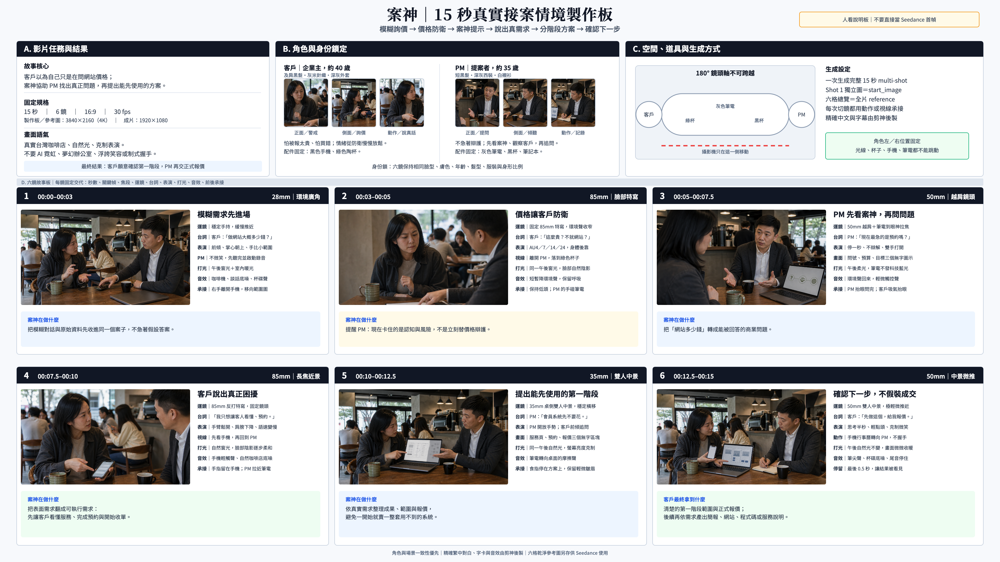
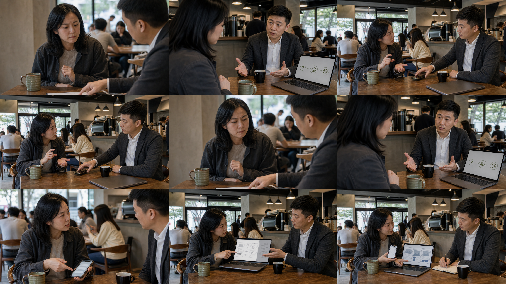
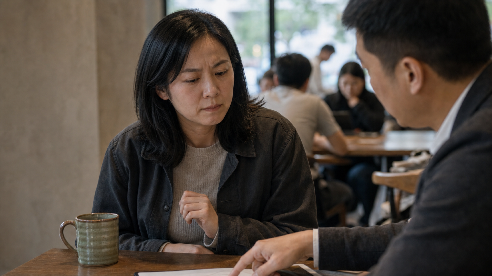
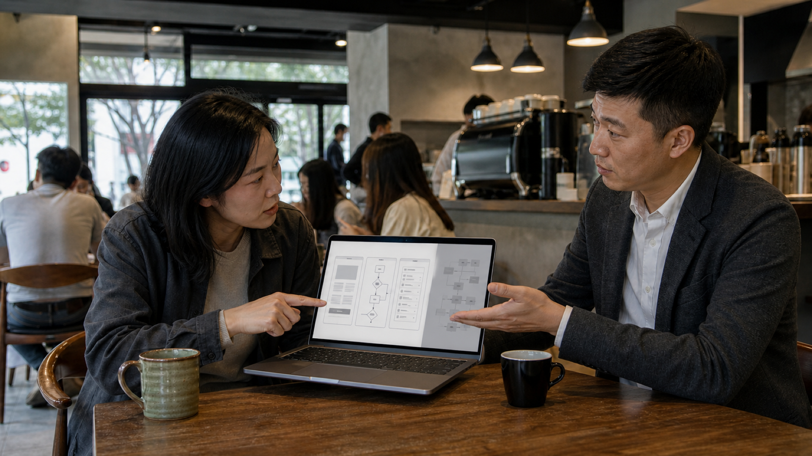

# 案神 15 秒接案情境｜Seedance 2.0／2.5 正式分鏡規格

## 這支影片在講什麼

一位企業主在咖啡店問 PM：「我只是想做一個網站，大概多少錢？」當她聽到初步價格，立刻皺眉、抿嘴、往後靠。PM 沒有急著替價格辯護，而是參考案神整理出的問題，追問她真正急著解決什麼。最後才發現，她現在需要的不是完整會員系統，而是一個能讓客戶預約、開始收單的頁面。

案神的價值不是替 PM 成交，而是幫 PM 看清資訊缺口、問對問題、產出符合現況的方案。

## 固定規格

- 成片：15 秒，1920 × 1080，16:9，30 fps。
- 中文製作板：3840 × 2160（4K），供人審閱，不當影片首幀。
- Seedance 模型參考板：3840 × 2160（4K），完全無字；上排是角色／場景錨點，下兩排是六鏡流程。
- 獨立關鍵幀：六張 3840 × 2160 PNG，放在 `storyboard-seedance/4k/`，實際拿來鎖首幀與角色細節。
- 場景：無品牌標誌的連鎖咖啡店，不拍夢幻辦公室。
- 角色：同一位台灣男性 PM 與同一位台灣女性企業主，全片臉、髮型、年齡與服裝一致。
- 文字：Seedance 畫面不生成任何可讀文字；繁中字卡與精確對白由剪神後製。

## 4K 中文電影製作板｜給人審閱



這張板依使用者指定格式拆成 A／B／C／D：共享創意指導、角色與身份鎖、空間與生成方式、六鏡故事板。每鏡都交代焦段、運鏡、台詞、表演、打光、音效與前後承接。

## 4K 無字模型參考板｜給 Seedance 理解全局



上排由左到右：客戶身份錨點、PM 身份錨點、共同咖啡店場景。中排與下排才是鏡頭 1–6，依左到右、再換下一排的順序閱讀。這張圖不含任何文字，可作為全片 reference image；鏡頭 1 的獨立 4K 圖才是 `start_image`。

## Seedance 實際生成方式

六鏡不是分成六次互不相干的生成。優先使用一次完成的 15 秒 multi-shot：

1. 模型選 Seedance 2.0 I2V，`duration = 15`、`aspect_ratio = 16:9`、`quality = high`。
2. `4k/shot-01-vague-need.png` 是影片 `start_image`，用來鎖定第一幀與角色初始位置。
3. `anson-storyboard-model-reference-4k.png` 是全片 reference image，讓模型理解角色、場景與六鏡順序；不要把它誤設成 `start_image`。若介面只接受一張圖片，只放鏡頭 1，並完整保留下面的 15 秒多鏡提示詞。
4. 實際送出必須組合：`全片連續性提示詞 + 15 秒多鏡提示詞 + 全片共同負面提示`，不能只複製單鏡描述。
5. 只有 15 秒 multi-shot 生成失敗時，才把 0–10 秒先生成，再用 Seedance Extend 接續 10–15 秒；不能重新開一個獨立生成。

## 全片連續性提示詞｜生成時必須完整附上

```text
STORYBOARD REFERENCE: Read the 4K nine-panel reference board as follows. The top row contains three identity anchors only: the client, the PM, and their shared coffee-shop environment. The middle and bottom rows contain Shots 1 through 6, ordered left to right, then top to bottom. It is a continuity map only. Never render the collage, panel borders, or multiple versions of the characters inside the video.

CONTINUOUS TIME AND PLACE: This is one uninterrupted 15-second client meeting during the same afternoon in the same unbranded Taiwan coffee shop. No time jump, no location change, no wardrobe change, and no reset of emotion between cuts. Preserve the same warm-neutral documentary color grade, soft window daylight, practical ceiling lights, realistic café background activity, and natural ambient sound across every shot.

CHARACTER IDENTITY LOCK: The client is the same Taiwanese woman, about 40, shoulder-length straight black hair with the same side part, beige-gray knit top under the same charcoal overshirt. The PM is the same Taiwanese man, about 35, short black hair with the same hairline, charcoal casual blazer, white shirt, no tie. Preserve their exact faces, age, body proportions, skin texture, hairstyle, and clothing in every shot.

SPATIAL LOCK AND 180-DEGREE RULE: The client remains on frame-left and the PM remains on frame-right in all two-shots. Their eyelines must always cross toward each other. Never cross the camera axis. Keep the client’s green ceramic mug, the PM’s small black cup, the gray laptop, the black phone, the wooden table, and the same seating positions consistent.

PERFORMANCE ARC: Do not reset the client’s emotion at each cut. Her continuous arc is guarded urgency, then price resistance, then cautious listening, then honest disclosure, then careful evaluation, then restrained relief. The PM stays calm and observant, never salesy and never smiling to hide tension. Facial muscle changes must be subtle and anatomically realistic, supported by breathing, gaze, hands, shoulders, and distance from the table.

CAMERA LANGUAGE: Natural documentary cinematography, realistic 28mm / 35mm / 50mm / 85mm lens changes, clean motivated cuts, stable handheld micro-movement, consistent exposure and white balance. Each cut must match one visible action, gaze, hand movement, or body posture from the previous shot. No orbiting glamour camera and no impossible camera teleport.

SPOKEN LANGUAGE AND TEXT: The later voice track will be natural Taiwanese Mandarin. During generation, do not create intelligible dialogue, subtitles, captions, letters, numbers, logos, brand marks, watermarks, or fake UI text. Mouth movement stays subtle and natural; exact dialogue and Traditional Chinese text are added by Janson in post-production.
```

## 首尾承接合約

| 接法 | 上一鏡最後動作 | 下一鏡第一動作 | 連續性目的 |
|---|---|---|---|
| 1 → 2 | PM 的右手離開手機，移向桌上的範圍圖 | 同一隻手指向範圍圖；客戶仍前傾看他 | 用手勢切入價格反應，不讓角色重新入戲 |
| 2 → 3 | 客戶往後靠、收手、視線落到桌面；PM 的手碰到筆電 | 從客戶肩後看 PM 打開筆電；客戶維持防衛姿勢 | 保留價格帶來的沉默，不突然恢復友善 |
| 3 → 4 | PM 看完案神後抬眼，雙手打開並問問題 | 客戶先維持低頭，再吸氣、抬眼看 PM | 用視線 match cut，讓「問對問題」有因果 |
| 4 → 5 | 客戶指著手機說出每天手動回覆的困擾 | PM 順著她的手勢把筆電轉向兩人中間 | 從需求證據直接接到解法，不跳過推理 |
| 5 → 6 | 客戶食指停在第一階段區塊，仍帶輕微皺眉 | 同一手指、同一位置開始；思考後才點頭 | 成交不是瞬間變開心，而是慎重確認下一步 |

## Seedance 15 秒完整多鏡提示詞

```text
Generate one continuous 15-second multi-shot clip using the individual 4K Shot 01 image as the start frame and the 4K nine-panel storyboard as a continuity reference. Follow the MASTER CONTINUITY block exactly. The top row is identity reference only. The middle and bottom rows contain Shots 1–6, read left to right and then top to bottom. Do not render the storyboard collage itself.

0.0–3.0s, Shot 1, 28mm environmental two-shot. The client sits frame-left and leans slightly forward. She speaks quickly, right palm upward, left fingers showing a small amount as if asking for a simple website price. The PM sits frame-right, listens without smiling, makes one small neutral nod, and activates the black phone recorder on the table. Slow subtle push-in. End with the PM’s right hand leaving the phone and moving toward the blank scope sheet.

At 3.0s, cut on the PM’s continuing right-hand motion. Preserve the exact positions, lighting, wardrobe, mugs, phone, laptop, and emotional state.

3.0–5.0s, Shot 2, 85mm close-up on the client. The PM’s same right hand points to the blank scope sheet at the edge of frame. The client pauses for half a beat, her breathing becomes shallow, then subtle FACS AU4, AU7, AU14, and AU24 appear. She moves about ten centimeters back, withdraws both hands toward her chest, and looks down at the green mug. She is guarded and afraid of overpaying, not angry. End with her gaze still lowered while the PM’s hand reaches the gray laptop.

At 5.0s, match cut from the client’s lowered gaze to an over-the-shoulder view from behind her. The PM opens the same gray laptop during the cut; do not reset either person’s posture.

5.0–7.5s, Shot 3, 50mm over-the-shoulder. The client remains softly out of focus in the left foreground, withdrawn and looking down. The PM does not defend the price. He pauses, looks at the laptop’s abstract Anson canvas with only a question icon, a balance icon, and a target icon connected by muted olive lines. Rack focus gently from the laptop to the PM’s eyes. He looks back to the client, slows his breathing, places open hands on the table, and begins one calm clarifying question. End with his eyes on the client and both palms open; hold the client’s guarded posture for the continuation.

At 7.5s, motivated reverse cut on the PM’s question and the client’s inhale. Preserve the exact final body positions, eyelines, props, lighting, and emotional tension from Shot 3.

7.5–10.0s, Shot 4, 85mm close-up on the same client. Begin with her eyes still lowered. She inhales, raises her gaze to the PM along the same eyeline, then looks at the black phone. Her AU4 and AU24 gradually release. Her arms uncross; she points to the phone’s blank chat bubbles and explains more slowly that repeated manual replies are the real problem. Her shoulders lower and she returns eye contact. End with her right index finger still pointing at the phone as the PM’s hand begins pulling the gray laptop toward the center.

At 10.0s, cut on the continuing hand movement. Preserve the client’s finger direction and the PM’s laptop movement.

10.0–12.5s, Shot 5, 35mm side two-shot. The PM rotates the same gray laptop into the shared center of the table. Its screen shows only three nonverbal blocks: a service-page thumbnail, a booking-flow icon, and a formal-proposal document; a complex membership-system module remains gray and deferred. The PM calmly indicates only the first stage. The client leans forward but does not smile or agree immediately. She studies the screen, keeps a slight AU4, and places her right index finger on the booking-flow block to ask one practical question. End with the finger held on that exact block.

At 12.5s, match cut on the client’s same finger and body position. Do not change the laptop screen layout.

12.5–15.0s, Shot 6, 50mm medium two-shot with a very gentle push-in. Start with her finger on the same first-stage block. She studies it for half a second, gives one small nod, then turns the black phone with a blank calendar grid toward the PM to arrange the next meeting. Her AU4, AU7, and AU24 relax into only a very subtle AU6 plus AU12 expression. No handshake and no advertising smile. The PM’s shoulders release; he nods once and writes the next step in the notebook. Hold the final settled frame for 0.5 seconds so the audience can feel that the work has become clear.
```

## 角色與真實需求

### 客戶

- 台灣女性企業主，約 40 歲，及肩黑髮，米色針織上衣與深灰外套。
- 表面需求：想知道「做一個網站多少錢」。
- 真實需求：目前靠 LINE 一個一個回覆客戶，希望先有能介紹服務、預約與收單的頁面。
- 心理狀態：怕被報太貴、怕買到用不到的功能，也怕自己不懂工程而吃虧。

### PM

- 台灣男性，約 35 歲，黑色短髮，深灰休閒西裝、白襯衫、不打領帶。
- 不急著推銷，不用笑容掩蓋衝突。
- 觀察客戶視線、手勢與坐姿，再參考案神提示追問真正需求。

## AU 使用原則

FACS Action Unit 只描述臉部肌肉動作，不直接等於情緒。本片用 AU 加上視線、呼吸、手勢與身體距離一起控制表演：

- AU4：眉頭下壓，出現在客戶聽到價格時。
- AU7：眼皮收緊，表現警戒與評估。
- AU14：單側嘴角收緊，表現懷疑。
- AU24：雙唇壓緊，表現暫時不想接受。
- AU6 + AU12：只在最後很輕地出現，表示放心，不做廣告式大笑。

## 全片共同負面提示

```text
畫面中不得出現任何可讀中文字、英文字母、數字、字幕、標誌、商標、浮水印、UI 亂碼或假文字。文件與螢幕只能用空白線條、幾何區塊、圖表、圖示與抽象色塊表達。不要讓人物全程微笑。不要豪華辦公室、夢幻逆光、紫藍霓虹、科幻全息投影、漂浮粒子、過度景深、過度磨皮或制式商業握手。人物臉部、髮型、服裝與年齡全片一致；不要多手指、扭曲手掌、重複人物、瞬間換裝或不符合物理的動作。
```

## 六鏡總表

| # | 時間 | 焦段／景別 | 主事件 | 客戶狀態 | 案神作用 |
|---|---:|---|---|---|---|
| 1 | 0.0–3.0 秒 | 28mm 環境廣角 | 咖啡店提出模糊需求 | 急著先問價格 | 收進原始對話 |
| 2 | 3.0–5.0 秒 | 85mm 臉部特寫 | 聽到初步價格後防衛 | AU4、7、14、24；往後靠 | PM 發現不能硬報價 |
| 3 | 5.0–7.5 秒 | 50mm 越肩鏡頭 | PM 看案神提示，改問目標 | 抱胸、避開眼神 | 提醒 PM 追問真正問題 |
| 4 | 7.5–10.0 秒 | 85mm 長焦特寫 | 客戶說出真正需求 | 手臂放開、視線回來 | 把表面需求轉成可執行需求 |
| 5 | 10.0–12.5 秒 | 35mm 雙人中景 | PM 提出分階段方案 | 仍慎重，開始比較 | 整理適合的成果與報價 |
| 6 | 12.5–15.0 秒 | 50mm 中景微推 | 客戶選定第一階段 | 輕點頭、克制微笑 | 確認下一步，不假裝保證成交 |

## 鏡頭 1｜客戶只問「做網站多少錢」


**目的**：讓觀眾立刻認出真實接案現場。客戶不是準備好規格才來，而是帶著一句模糊問題出現。

**表演與肢體語言**

- 客戶坐在咖啡店靠牆座位，手機放桌上，身體略往前，手掌朝上，說話快。
- 她用一隻手比出小範圍，暗示「我只是要一個簡單網站」。
- PM 沒有立刻回答價格，只保持中性表情、微微點頭並開啟錄音。

**對白意圖**

- 客戶：「我只是想做一個網站，大概多少錢？」
- PM 此時不回答，避免沒有範圍就亂報價。

**Seedance 單鏡參考提示詞**

```text
1920×1080、16:9、30fps、寫實台灣接案紀錄片風格。無品牌標誌的連鎖咖啡店下午時段，有其他客人模糊經過，真實環境聲與咖啡機聲。固定角色：40 歲台灣女性企業主，及肩黑髮，米色針織上衣、深灰外套；35 歲台灣男性 PM，黑色短髮，深灰休閒西裝、白襯衫、不打領帶。28mm 環境廣角雙人鏡頭，保留桌面、咖啡杯與周遭人流，攝影機手持但穩定，緩慢靠近。女客戶身體略往前、語速偏快，右手掌心朝上，左手比出很小的範圍，像在說「只是一個簡單網站」，眼神直接但帶著防備。男 PM 保持中性表情，不急著微笑或報價，只微微點頭、開啟手機錄音並聽完。兩人互動有距離感，不像熟朋友。結尾停在 PM 準備回應前。畫面內完全沒有可讀文字、字幕、字母、數字、Logo、品牌標誌或 UI 亂碼。
```

## 鏡頭 2｜一聽價格，客戶立刻防衛



**目的**：顯示真正的難點不是價格本身，而是客戶還不知道自己買的是什麼。

**表演與肢體語言**

- PM 指向一張沒有文字的粗略範圍圖，語氣平穩地說出初步區間。
- 客戶呼吸停半拍，AU4 眉頭下壓、AU7 眼皮收緊、AU14 單側嘴角收緊、AU24 抿嘴。
- 她把身體往後拉、手臂靠近胸口，視線短暫離開 PM，看向桌面。

**對白意圖**

- 客戶：「這麼貴？不就是一個網站嗎？」
- 不要求 Seedance 正確生成中文聲音；後製再配。

**Seedance 單鏡參考提示詞**

```text
延續上一鏡完全相同的咖啡店、角色、服裝、桌面與光線。85mm 長焦臉部特寫，淺景深只隔離女客戶的真實微表情，鏡頭固定、不繞拍。畫外的男 PM 用手指向桌上一張沒有文字的粗略範圍圖，平靜說明初步價格區間。女客戶先停頓半拍，吸氣變淺；接著呈現 FACS AU4 眉頭下壓、AU7 眼皮收緊、AU14 單側嘴角收緊、AU24 雙唇壓緊。她的上半身往椅背移動約十公分，雙手從桌面收回靠近胸前，視線離開 PM、落到桌上的咖啡杯。表情是警戒、懷疑與怕吃虧，不是憤怒，也不要微笑。環境音短暫變安靜，留下咖啡店背景聲。畫面內完全沒有任何可讀文字、字幕、字母、數字、Logo 或亂碼。
```

## 鏡頭 3｜PM 不辯解，先看案神建議


**目的**：案神不是替 PM 說話，而是在關鍵時刻提醒 PM 不要陷入價格攻防。

**表演與肢體語言**

- 客戶抱胸，視線留在桌面，形成短暫沉默。
- PM 沒有追著解釋，視線短暫移到筆電上的案神整理畫布。
- 畫布以抽象卡片顯示「需求不明、預算防衛、先問商業目標」，但畫面不能出現文字。
- PM 看完後把視線放回客戶，聲音放慢。

**對白意圖**

- PM：「你現在最急著解決的，是先有人能預約，還是要做完整會員系統？」

**Seedance 單鏡參考提示詞**

```text
延續同一咖啡店與固定角色。50mm 越肩鏡頭，從女客戶肩後看向男 PM、桌面與筆電。女客戶前景稍微失焦，雙手靠近胸口，身體仍往後，視線朝下。男 PM 沒有立刻辯解價格，他先安靜停一秒，視線短暫移到筆電上的案神無限畫布。螢幕只顯示三組無文字抽象卡片：一組問號圖示、一組預算刻度圖形、一組目標靶心圖示，低彩度橄欖綠細線連接。PM 看完後合上防衛姿勢，雙手攤開放在桌上，重新看向客戶，以更慢、更低的語速提出一個澄清問題。鏡頭做非常輕微的 rack focus，從筆電畫布移到 PM 的眼神。畫面真實克制，不要科技魔法效果。不得出現任何可讀文字、字幕、字母、數字、Logo 或 UI 亂碼。
```

## 鏡頭 4｜客戶終於說出真正需求


**目的**：表面上她在問網站價格，真正困擾是每天用 LINE 手動回覆，無法有效收單。

**表演與肢體語言**

- 客戶先看 PM，再看自己的手機，確認對方真的理解問題。
- AU4、AU24 逐漸放鬆；手臂從胸前鬆開，右手指向手機上的多筆無文字對話泡泡。
- 她開始說得更慢、更具體，肩膀下降，視線回到 PM。

**對白意圖**

- 客戶：「我其實只是想讓客人先看懂服務、直接預約，不想每天一直回 LINE。」

**Seedance 單鏡參考提示詞**

```text
延續相同角色與咖啡店。85mm 長焦近景，拍女客戶從防衛轉為願意說真話的細微變化。她先看男 PM 一眼，再低頭看自己的手機；手機只顯示多個空白圓角對話泡泡，不可有文字。她原本的 AU4 眉頭下壓與 AU24 抿嘴逐漸放鬆，雙手從胸前鬆開，右手食指指向手機，左手掌心向上。肩膀下降，呼吸恢復，視線重新回到 PM，說話速度從快變慢，像在解釋每天重複回覆客戶、真正需要先讓客戶看懂服務並完成預約。男 PM 只在畫面邊緣安靜聽，不搶話。情緒不是突然開心，而是因為被理解而願意透露真正困難。畫面內不得出現任何可讀文字、字幕、字母、數字、Logo、品牌標誌或亂碼。
```

## 鏡頭 5｜案神整理出適合的第一階段



**目的**：不是把全部功能都賣給客戶，而是依真正問題提出能負擔、能先使用的方案。

**表演與肢體語言**

- PM 把筆電轉向客戶，畫面只有三個清楚區塊：服務說明頁、預約流程、正式報價。
- 完整會員系統以灰色延後圖示放在旁邊，不急著賣。
- 客戶沒有立刻答應，先前傾閱讀、指向第一階段並追問。

**對白意圖**

- PM：「那我們先做能介紹服務、預約和收單的第一階段，會員系統先不要花。」

**Seedance 單鏡參考提示詞**

```text
延續同一咖啡店、角色與光線。35mm 雙人中景，攝影機位於桌面側面，保留兩人的手、筆電與真實咖啡店背景。男 PM 把筆電緩慢轉向女客戶，螢幕以無文字圖像呈現三個第一階段成果：服務網站版面縮圖、預約流程圖示、正式報價文件；旁邊一個代表完整會員系統的複雜模組以灰色淡出，表示延後而不是刪除。PM 手勢開放，指向第一階段，不強迫推銷。女客戶沒有馬上微笑或握手，她身體重新前傾，仔細看畫面，食指指向預約流程圖示並提出問題，眉頭仍有輕微 AU4，顯示她在認真比較而不是被說服。兩人共同看同一個畫面，氣氛從價格攻防轉成討論解法。不得出現任何可讀文字、字幕、字母、數字、價格、Logo 或 UI 亂碼。
```

## 鏡頭 6｜確認下一步，不假裝保證成交


**目的**：真實接案的成功不是立刻大笑握手，而是客戶願意選定範圍、確認下一個行動。

**表演與肢體語言**

- 客戶再次看完三項成果，手指停在第一階段，輕點頭。
- 她把手機行事曆轉向 PM，表示願意約下一次確認，不做品牌握手。
- 只出現很輕的 AU6 + AU12；PM 放鬆肩膀，記下下一步。

**對白意圖**

- 客戶：「那先從這個開始，你把正式報價給我。」

**Seedance 單鏡參考提示詞**

```text
延續完全相同的咖啡店、男女角色、服裝、桌面與下午自然光。50mm 中景雙人鏡頭，攝影機非常輕微推近。女客戶再次看完筆電上的三個無文字第一階段成果，右手食指停在代表服務網站與預約流程的區塊，思考半秒後輕輕點頭。她沒有誇張大笑，也沒有立刻握手，而是把顯示空白行事曆格線的手機轉向男 PM，表示願意安排下一次確認。她的 AU4、AU7、AU24 已放鬆，只留下非常輕微的 AU6 加 AU12 克制微笑。男 PM 肩膀放鬆，點頭後在筆記本記下下一步。最後停留 0.5 秒，讓觀眾看見「事情被說清楚」。環境音保留咖啡店背景與筆尖聲，不生成可辨識對白。畫面內不得出現任何可讀文字、字幕、字母、數字、Logo、品牌標誌或亂碼。
```

## 剪神後製層

Seedance 原始畫面不放字。六段影片確認後，由剪神加入精確繁中字卡、台灣中文對白或旁白、環境音與輕量 SFX：

| 時間 | 後製內容 |
|---:|---|
| 0.4 秒 | 客戶問：「做一個網站，大概多少錢？」 |
| 3.2 秒 | 畫面短暫收窄環境聲，留下客戶皺眉反應 |
| 5.3 秒 | 字卡：先別急著解釋價格，先問真正目標 |
| 7.8 秒 | 客戶說出「我想先讓客人能預約」 |
| 10.3 秒 | 字卡：先做現在用得到的，再談完整系統 |
| 13.0 秒 | 收尾：案神，幫 PM 把需求問清楚 |

## 驗收條件

- 六張圖各自為 1920 × 1080 PNG，不以六格合併圖冒充分鏡。
- 咖啡店、角色臉部、服裝與光線連續。
- 鏡頭 2 必須看得出價格防衛；鏡頭 4 必須看得出開始說真話；鏡頭 6 不能用制式握手。
- Seedance 圖片與原始影片不含可讀文字，中文全部後製。
- Fish 確認六張正式分鏡與本文件後，才進 Seedance 成片。
