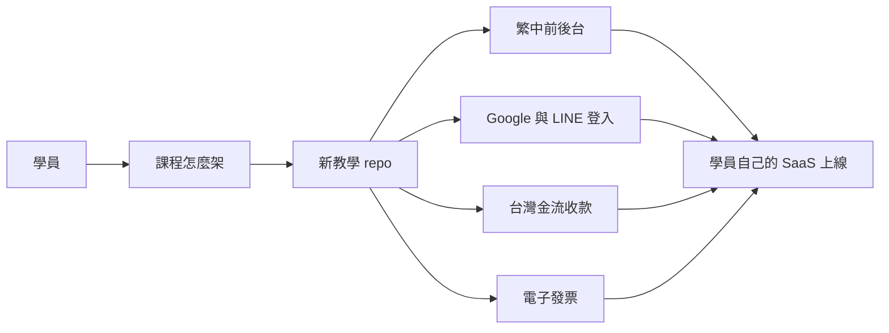
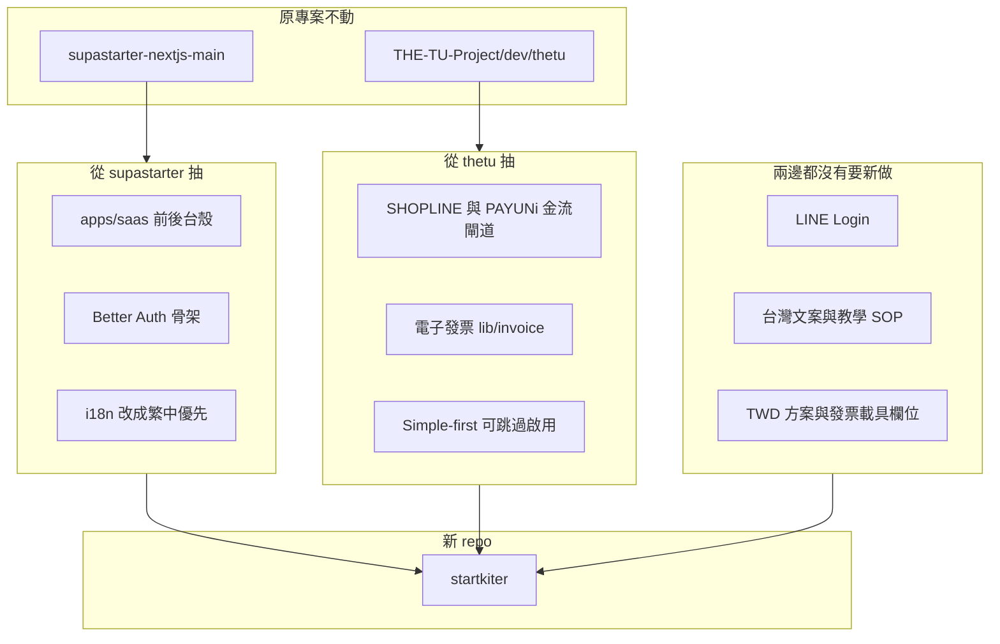

▋ 2026-08-14 對焦結論

討論角色是架構主控，不是 PM、不是專案工程師。本篇只記決定，不寫業務代碼。

【成品是什麼】

這包是獨立產品 StartKiter。不是客戶平台 libon.me，也不是 THE-TU 賣課站。THE-TU 只抽金流／發票／啟用方式。這次抽的是能力，不是把客戶專案或賣課系統融進來。

學員複製模板後，用 AI 改自己的生意介面。底層登入、金流、發票不要讓他們從零寫。

【合併怎麼做】

不要把兩份完整專案黏成一個 repo。硬融會變成 NextAuth 對上 Better Auth、兩套資料表、兩套後台、課程與影片邏輯漏進來。學員學的會變成修衝突。

正確做法：開全新 repo，只抽能力。`THE-TU-Project/dev/thetu` 與 `supastarter-nextjs-main` 維持獨立、這次不改。

【現況事實】

supastarter-nextjs-main 有前後台、組織、Google 登入、國際金流 Stripe / Lemon / Polar / Dodo。沒有 LINE。沒有 PAYUNi / SHOPLINE。沒有台灣發票。方案預設 USD。

THE-TU `dev/thetu` 才是台灣金流來源。Simple-first、setup 可跳過、SHOPLINE 主推、發票預設關、Zeabur 客戶交付。仍是賣課系統、NextAuth、沒有 LINE。SHOPLINE 不做訂閱。詳見 2026-08-14-thetu-source.md。

LINE 登入是新功能。thetu 也沒有。

舊教學 SOP 寫 v1 不要登入、不要後台、不要金流。這次需求把它推翻。教學文件要重寫。不過啟用方式要抄 thetu：功能做進去、預設關掉、第 1 堂只求能上線。

【一次到位拆兩層】

程式包 v1 一次齊：繁中前後台、Google、LINE、台灣金流、電子發票。

課程必須分堂打開。第一堂不要把 LINE Developers 跟發票加值中心全塞進去。申請帳號不是寫程式能代勞的。

• 第 1 堂 開箱：繁中前後台能上線、能進後台

• 第 2 堂 門牌：Google 先通，LINE 當後半或下一堂

• 第 3 堂 水龍頭：串 SHOPLINE，測一筆付款，後台看到訂單

• 第 4 堂 發票：同一筆訂單開出發票／載具／統編；測試環境先走，正式開立要營業登記

【今天釘死的三個決定】

主金流：SHOPLINE。PAYUNi 留在模板當第二家。Stripe 可選、不當台灣小白第一條路。詳見 payment-and-deploy.md。

部署：常駐 Node（Zeabur 這類）。不當預設 Vercel serverless。詳見 payment-and-deploy.md。

組織多租戶：v1 不抽。一個老闆一個後台。詳見 organizations.md。

【下一步還沒做】

討論稿已進 `products/startkiter/docs/discuss/`。獨立 git 已存在。開始抽代碼前，以 extract-map.md 當施工清單，施工單只開在這個 repo 的 openspec/changes/。
