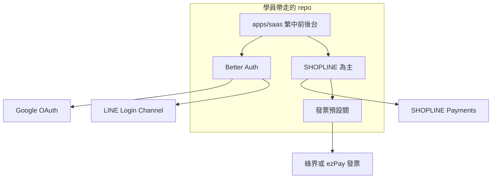

▋ 架構 draft：這包怎麼運作

狀態：partially superseded（2026-08-15）

▋ 現行規則

產品 SSOT：`openspec/specs/`。主金流 PAYUNi only；發票不在 MVP；Shopline 不上課。站殼與登入已落地。下文含 SHOPLINE／發票預設的圖與段落是早期草稿，僅供對照。

仍有效：獨立 repo、施工單只開在本 repo `openspec/changes/`、不抽 Organization、LINE 只做 Login Channel、部署常駐 Node。

---

狀態（原稿）：repo 已建（2026-08-14）。獨立 git 在 `products/startkiter`。討論稿副本在 `docs/discuss/`。施工單只准開在這個 repo 的 `openspec/changes/`，不准開在 Development 根目錄。

【要不要另找 agent 寫計畫】

不要。現在這個對話就是架構主控。另派一個 agent 會丟掉我們已經釘死的來源（thetu、line-hub、supastarter）、SHOPLINE 不做訂閱、不抽組織。它會重問一遍，或寫一份跟這資料夾打架的 SR。

現在該做的是把這份 draft 談完、把資料夾名字定下來。名字定了、你說可以施工，再在新 repo 裡走 `spectra-propose`。那時候才需要第二個 agent 當反向審查，不是現在。

【LINE 只做登入】

學員在 LINE Developers 只開「LINE Login」Channel。不開 Messaging API、不開 LIFF App、不申請 Bot。

Better Auth：

```ts
socialProviders: {
  line: {
    clientId: process.env.LINE_CLIENT_ID,
    clientSecret: process.env.LINE_CLIENT_SECRET,
  }
}
```

前端：`authClient.signIn.social({ provider: "line" })`

Callback：`https://學員網址/api/auth/callback/line` 填進 LINE 後台。scope 用預設 openid / profile / email。沒填 Channel 就藏按鈕。email 可能空，用 LINE userId 當帳號主鍵，沒信箱就合成後備或請補填。

這跟 line-hub 網頁 OAuth 同一條協定。PHP、LIFF、加好友、推播，全部不進 v1。

【整包怎麼運作】



學員複製 repo → Zeabur 掛 PostgreSQL 與 `/data` → 網站先能開。Google、LINE、金流、發票都是後台開關。課四堂依序打開，不是第一堂全開。

StartKiter 是獨立新專案。不掛在 libon.me 上賣、不共用它的帳號、網域、課、代碼。libon.me 是客戶平台，跟這包無關。THE-TU 只當台灣金流／發票／Simple-first 的抽取來源，不是 StartKiter 的賣場。

【資料夾叫什麼】

工作名稱 lock：`products/startkiter`。對外課名仍可用「開站包」。網域優先盯 `startkiter.com`，備案 `startkiter.me`。whois 目前都沒登記，下單前再查一次。

老闆判斷：StartKit.AI 打美國／英文 AI boilerplate，我們打中文、LINE 登入、台灣金流。客群分開，品牌撞車不是第一優先。

這個判斷對「誰會付錢」大致成立。台灣小白不會去買 startkit.ai。廣告、LINE、SHOPLINE、發票，那些人跟 James/Danielle 的 GitHub boilerplate 買家不是同一群。

還在的風險比較小，但不是零。

→ 1 Google 台灣也會出英文結果。有人搜 startkiter、starter kit，仍可能先看到 StartKit.AI。

→ 2 打字會少一個 er，變成 startkit。那條路是別人的。

→ 3 以後若做英文版或 GitHub 公開，這層隔離會變薄。那時再評估要不要副品牌。

現階段：資料夾用 startkiter。網域買到寫進自己的課綱與官網。沒買到就先用 Zeabur 子網域或之後再買，不要借客戶的 libon.me 當官網或賣場。

【施工狀態】

資料夾名字已 lock：`startkiter`。獨立 git 已存在。

v1 一次買斷已定，月繳明確不做。這點寫進 SR 的 non-goals。

下一步是在這個 repo 裡對「抽殼＋台灣金流」開 Spectra change。不是接到 libon.me。還沒抽應用程式碼。
