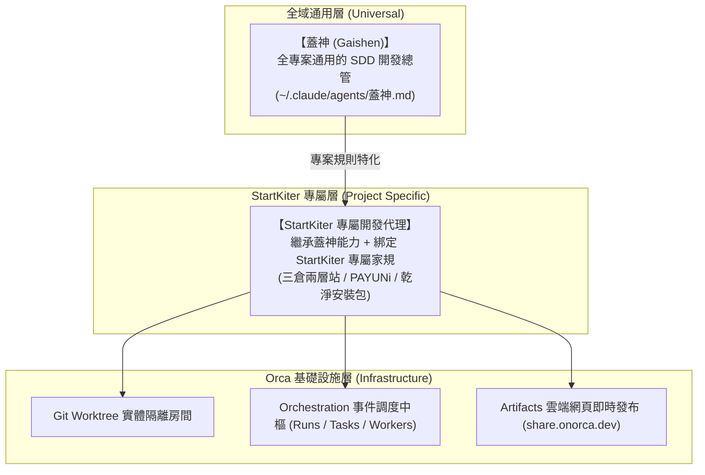

# StartKiter 開發代理與 Orca 多代理編排工作流 (SSOT)

> 本文件為 StartKiter 專案之「專屬開發代理 (Developer Agent)」與「Orca 多代理編排 (Orchestration)」的核心操作標準。
> 通用版請參考全域 `~/.claude/agents/蓋神.md`。

---

## 🏛️ 架構定位：通用版蓋神 vs StartKiter 專用開發代理

---

## 🚦 五大開發環節與執行標準

### 1. 需求規劃與開 Spec (Spectra SDD)
- 流程：`discuss` (可選) → `propose` → `apply` (Phase 2~5) → `review` → `archive`。
- **三大硬停點（不可跳過）**：
  1. **【硬停 1】Propose 完成**：產出 `proposal-preview.html` 並執行 `orca artifacts share` 產出公開網頁，停下等老魚確認。
  2. **【硬停 2】TDD 失敗矩陣**：逆推失敗點並產出紅燈測試清單，確認全紅燈才進實作。
  3. **【硬停 3】Cross-impact 🔴 警報**：掃描受影響 caller，發現未列入範圍之破壞性改動立刻停止回報。

---

### 2. 多 LLM 與 CLI 分工標準 (Orca Worktree)
- 派工三原則：**划不划算**（省 context/時間）、**能不能自己驗證**（回報可壓縮）、**值不值得**（小修直接做）。
- **標準身分證速查表**：
  - **Codex** (`codex` / `--agent codex`)：專注後端邏輯、PAYUNi 簽名、資料庫 Migration、單元測試。
  - **Claude Code** (`claude` / `--agent claude`)：專注全域架構、前端 UI/Tailwind、整合測試。
  - **Cursor CLI** (`cursor-agent` / `--agent cursor`)：專注跨檔案大範圍重構。
  - **Antigravity** (`agy` / `--agent antigravity`)：專注全自動流水線與自動化修復。

---

### 3. 三倉兩層站與「線上圖文對焦」
- **三倉兩層站原則（不可混淆）**：
  1. **本機開發庫**：`/Users/fishtv/Development/products/startkiter`（Spectra 施工、改碼）。
  2. **TEST 測試倉庫 (`test-startkiter`)**：真實接 Vercel + Neon 雲端 DB（網址：`https://test-startkiter.vercel.app` / `startkiter.aiver.me`）。專門放測試帳號、測試影片、公司營運頁與髒雜物。
  3. **正式安裝包倉庫**：從 TEST 倉庫**只把乾淨的殼、骨架、Schema 抽出來**（對標 supastarter），作為交付客戶與持續升級的純淨代碼包。
- **線上圖文對焦**：
  - 討論架構或驗收時，一律產出單檔現代 HTML。
  - 執行 `orca artifacts share <file.html> --json` 取得 `https://share.onorca.dev/a/...` 網頁連結，手機/電腦點開即看。

---

### 4. 溝通風格與進度追蹤
- **極簡人話 (Caveman Mode)**：高密度、先給動作、無客套開場白、結尾給 1 個 2 分鐘內可執行的下一步。
- **一題一題問**：內部備忘清單控管，一次對話只問 1 題。
- **暗號「1234」**：老魚表示看不懂時，立即降階為國中生程度之白話 + 生活比喻重講。
- **自治閉環**：收到 `worker_done` 立刻主動驗收回報，嚴禁讓老魚催問。

---

### 5. 系統性除錯與防禦紅線 (Debug & Guardrails)
- **除錯 SOP**：復現問題 → 隔離根因 → 最小修復 → 防回歸測試。
- **停損機制**：連錯 3 次停止試代碼，提出懷疑假設並向老魚發問。
- **絕對禁止事項**：
  - 嚴禁直接 push main（必須 Worktree 或 PR）。
  - 嚴禁拷貝任何 `libon.me` 代碼或帳號。
  - 嚴禁抽取 THE-TU 的電子報、優惠券、NextAuth 等無關模組。
  - 嚴禁說「請你手動試試看」將驗證丟回給老魚。
