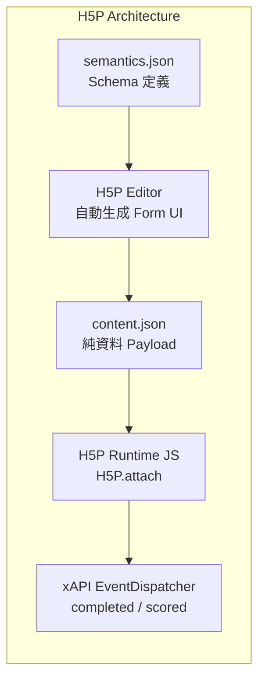
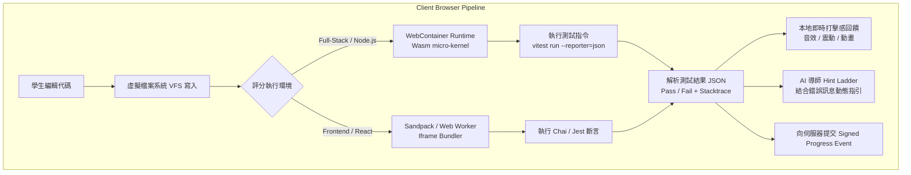
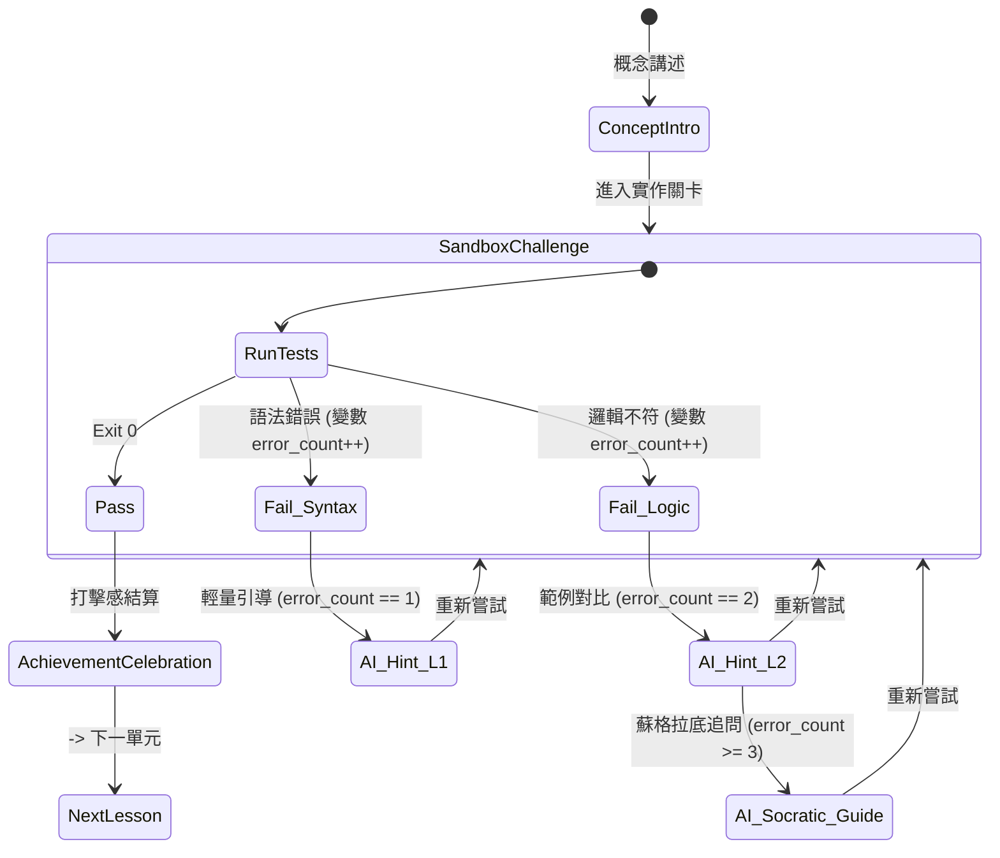

# StartKiter 課程引擎（Course Engine）架構調研報告

> **報告定位**：教學／內訓／服務型內容產業的通用底層「課程引擎」架構研究。探討如何從單純的後台編輯器與 LMS，演進為類似遊戲引擎（Unreal/Godot）之於遊戲的通用教育運行底層。

---

## 目錄
1. [H5P 深度架構比較與 LLM 整合](#1-h5p-深度架構比較與-llm-整合)
2. [開源「課程引擎／學習引擎」先例與架構模式](#2-開源課程引擎學習引擎先例與架構模式)
3. [互動式程式沙盒評分管線架構（WebContainer / Sandpack / freeCodeCamp）](#3-互動式程式沙盒評分管線架構webcontainer--sandpack--freecodecamp)
4. [敘事／分支式狀態機引擎（Ink / Yarn Spinner / Twine）借鏡](#4-敘事分支式狀態機引擎ink--yarn-spinner--twine借鏡)
5. [LLM 可插拔架構設計模式（Provider-Agnostic Engine）](#5-llm-可插拔架構設計模式provider-agnostic-engine)
6. [產業定位與產品敘事參考（Headless Course Engine）](#6-產業定位與產品敘事參考headless-course-engine)
7. [StartKiter 課程引擎落地切入點與 7 積木演進建議](#7-startkiter-課程引擎落地切入點與-7-積木演進建議)

---

## 1. H5P 深度架構比較與 LLM 整合

### 1.1 H5P 外掛架構核心機制
H5P ([h5p.org](https://h5p.org)) 是目前開源界最成功的可擴充互動內容標準，其核心解耦為三大宣告式規格：

1. **`library.json`（組件元資料與依賴樹）**：
   - 定義 machine name、semver 版本號、執行時 JavaScript/CSS 依賴、以及依賴的其他 H5P 組件（例如 `H5P.InteractiveVideo` 依賴 `H5P.Video` 與 `H5P.Quiz`）。
2. **`semantics.json`（宣告式資料結構與編輯器自動生成）**：
   - **這是 H5P 最關鍵的設計**。它使用 JSON 描述組件所需的資料結構（`text`, `number`, `boolean`, `list`, `group`, `select`, `library`）。
   - **雙重用途**：
     - **編輯器生成**：H5P 核心解析 `semantics.json`，自動生成後台可視化表單 UI，作者完全不需要自己寫 Admin React/Vue Form。
     - **資料校驗**：存檔與渲染前自動做結構與型別校驗。
3. **`content.json`（純資料負載）**：
   - 課程作者實際建立的資料，符合 `semantics.json` 的定義。
4. **Runtime DOM 容器與 EventDispatcher**：
   - 執行時透過 `H5P.attach($container)` 掛載，內部由 `H5P.EventDispatcher` 拋出標準事件（xAPI 規格：`interacted`, `answered`, `completed`, `passed`）。



### 1.2 H5P vs StartKiter 現有「7 積木 MDX 白名單」比較

| 維度 | H5P 架構 | StartKiter 現有 7 積木 MDX 架構 | 長期擴充性裁決 |
| :--- | :--- | :--- | :--- |
| **宣告方式** | JSON Schema (`semantics.json`) + 打包 JS/CSS | React Component + MDX AST 白名單過濾 | **H5P 在「開放生態」勝出；MDX 在「開發體驗與效能」勝出** |
| **編輯器生成** | 由 Schema 自動生成 Form，零後台代碼 | 需為每個積木手寫 Studio 表單或直接編輯 MDX | **H5P 的自動化表單勝出** |
| **第三方擴充** | 支援動態上傳 `.h5p` 封裝包，無需重新編譯宿主 | 必須在 Core 編譯期打包註冊，外部無法動態插拔 | **H5P 的熱插拔勝出** |
| **安全性** | iframe 隔離或受限 DOM 執行 | 嚴格 AST 白名單，不解析 raw HTML / script | **MDX 白名單極乾淨且安全** |
| **現代前端整合** | 偏舊（歷史包袱重，依賴 jQuery 與原生 DOM 操作） | 原生 React 19 / Server Components / Tailwind | **StartKiter 現代前端技術棧勝出** |

### 1.3 H5P 與 LLM / AI 整合案例
1. **H5P Smart Import (H5P.com 官方)**：
   - **機制**：官方推出的 AI 生成工具。輸入 PDF/URL/影片字幕，由 LLM 解析後直接輸出符合特定 H5P content type 的 `content.json`，自動組合成 Interactive Book 或 Quiz。
   - **核心優勢**：因為 H5P 的內容就是嚴格遵循 `semantics.json` 的 JSON，**LLM 天然極度擅長輸出結構化 JSON**（Structured Outputs / Tool Calling）。
2. **Lumi.run (開源桌面/雲端 H5P 編輯器)**：
   - GitHub: [Lumieducation/Lumi](https://github.com/Lumieducation/Lumi)
   - 具備 Headless 渲染能力，社群常拿它作為批次將 AI 生成內容打包成 `.h5p` 檔案的 CLI 工具。

> **跟 StartKiter 比較**：
> - **哪裡像**：核心都是「定義一組受限的互動語彙，透過宣告式參數驅動渲染與進度回傳」。
> - **哪裡不像**：H5P 是 2014 年代的 jQuery/Iframe 巨型封裝包架構；StartKiter 是現代 Next.js/React + MDX。StartKiter 應借鑑 H5P 的 **`semantics.json`（Schema 驅動編輯器＋LLM 結構化輸出）**，而非其老舊的封裝與渲染機制。

---

## 2. 開源「課程引擎／學習引擎」先例與架構模式

除了傳統以「行政管理、選課、學籍」為核心的巨型 LMS（Moodle, Canvas, Blackboard）之外，教育界有以下幾種專注於「內容組裝與渲染引擎」的先例：

### 2.1 Open edX XBlock 架構
- **專案**：[openedx/XBlock](https://github.com/openedx/XBlock)
- **定位**：Open edX 的積木式組件運行底層。將「課程」視為 XBlock 的巢狀樹狀結構（Course > Section > Subsection > Unit > XBlock）。
- **架構設計**：
  - 每個 XBlock 是一個微型 Web 元件，具備自己的 Storage Layer（進度、作答）、Views（學生端視圖 `student_view`、編輯端視圖 `studio_view`）與 Handlers（處理前端 Ajax 事件）。
  - **Container XBlock**：積木本身可以包含子積木（支援分支與條件邏輯）。
- **借鑑價值**：XBlock 確立了「課程就是組件樹」的抽象模型。

### 2.2 Adapt Learning Framework
- **專案**：[adaptlearning/adapt_framework](https://github.com/adaptlearning/adapt_framework)
- **定位**：專門產出響應式、外掛化互動課程的開源「課程組裝引擎」。
- **架構設計**：
  - 基於 JSON 驅動的四層結構：Course → Page → Article → Block → Component。
  - 所有互動元件（Drag & Drop, Narrative, Hotspot, Accordion）皆為獨立 Plugin，透過 `bower.json` / `package.json` 宣告依賴與 Schema。
  - 完全 Headless，課程輸出為靜態 JSON + 靜態資產。
- **借鑑價值**：將「頁面排版與互動組件」完全解耦為 Schema，由統一的 Engine Core 負責算力與進度收集。

### 2.3 ClassroomIO & OpenCourseEngine
- **專案**：[rotimi-best/classroomio](https://github.com/rotimi-best/classroomio)
- **定位**：現代開源 Headless LMS / Education OS，基於 Supabase + Next.js。
- **架構設計**：
  - 將課程數據（Curriculum tree）、學員狀態（Learner states）、權限全部 API 化，前端透過 SDK 掛載自定義 Classroom 介面。

> **跟 StartKiter 比較**：
> - **哪裡像**：都嘗試將「互動內容」從「平台宿主」中抽離成可插拔的組件。
> - **哪裡不像**：XBlock 與 Adapt 仍偏向「靜態內容消費」；StartKiter 追求的是結合 **WebContainer 實作沙盒 + AI 導師雙向動態敘事** 的新世代即時引擎。

---

## 3. 互動式程式沙盒評分管線架構（WebContainer / Sandpack / freeCodeCamp）

教學平台在做「學生寫代碼 → 自動評分 → 即時回饋」時，有三種主流管線架構：



### 3.1 StackBlitz TutorialKit（最直接的開源 WebContainer 課程架構先例）
- **專案**：[stackblitz/tutorialkit](https://github.com/stackblitz/tutorialkit)（官方教學站框架，如 SvelteKit、Nuxt、Astro 官方互動教學皆採用）
- **管線架構**：
  1. **Template & Step 繼承模型**：每個關卡是 MDX 檔，定義起點代碼（Template）、目標檔案（Target files）與測試規範。
  2. **WebContainer API**：在瀏覽器內啟動 Wasm Node.js 執行緒，掛載虛擬檔案系統（VFS）。
  3. **自動測試驗證**：在背景執行 `npm test` 或 Vitest，監聽測試進度串流。
  4. **無伺服器成本**：所有 Node.js、編譯、打包、測試 100% 在學員瀏覽器消耗 CPU，後端零運算負擔。

### 3.2 freeCodeCamp Challenge Runner 架構
- **專案**：[freeCodeCamp/freeCodeCamp](https://github.com/freeCodeCamp/freeCodeCamp)
- **管線架構**：
  - 核心模組：`curriculum` + `frame-runner` + `test-evaluator`。
  - 題目定義在 Markdown frontmatter，內嵌 `tests` 陣列（包含 Chai.js 斷言代碼）。
  - 學員代碼透過 Web Worker / 隔離 iframe 執行，將代碼字串與測試斷言結合後 `eval`，回傳 `{ pass: boolean, err: string }`。

### 3.3 Sandpack (@codesandbox/sandpack-react)
- **專案**：[codesandbox/sandpack](https://github.com/codesandbox/sandpack)
- **管線架構**：
  - 聚焦於前端框架（React, Vue, Svelte）的記憶體內即時 Bundler。
  - 適合快速預覽 UI 元件，但不支援跑原生 Node.js CLI、檔案系統腳本與後端資料庫。

### 3.4 評分與打擊感回饋架構表

| 平台 / 工具 | 執行環境 | 測試機制 | 回饋延遲 | 適用場景 |
| :--- | :--- | :--- | :--- | :--- |
| **TutorialKit (WebContainer)** | 瀏覽器內 Wasm Node.js | 原生 Vitest / Jest 執行 | 100–300ms | 全端、API、後端、CLI、現代前端 |
| **freeCodeCamp** | Web Worker + Iframe | Chai.js 字串斷言 | < 50ms | 演算法、基礎 JS/HTML/CSS |
| **Sandpack** | In-browser Bundler | DOM / React Test Utils | 100–200ms | 前端 UI 元件練習 |
| **傳統 Online Judge** | 遠端 Docker / Firecracker | 伺服器端隔離容器執行 | 1000–3000ms | 多語言（C++/Python/Java）重型運算 |

> **跟 StartKiter 比較**：
> - **結論**：StartKiter 的 SR-B（學生實作沙盒）**最適合採用 TutorialKit / WebContainer API 模式**。
> - 關卡結構直接映射到檔案系統，以 `vitest --reporter=json` 做自動斷言，測試通過觸發「打擊感慶祝動畫」，測試失敗將 JSON 錯誤餵給 AI 導師產出階梯式提示（Hint Ladder）。

---

## 4. 敘事／分支式狀態機引擎（Ink / Yarn Spinner / Twine）借鏡

當課程走向「非線性通關」、「依能力動態分支」與「AI 扮演角色引導」時，純粹的線性章節列表無法滿足需求。遊戲敘事引擎提供了極佳的底層狀態機設計：

### 4.1 Inkle's Ink（專業遊戲敘事語言）
- **專案**：[inkle/ink](https://github.com/inkle/ink)（驅動《80 Days》、《Heaven's Vault》等知名遊戲）
- **核心架構模式**：
  1. **Knots & Stitches（節點與子情境）**：
     - 課程可以組織為 `=== lesson_authentication ===`（Knot），其下有 `= jwt_basics`、`= cookie_session_compare`（Stitches）。
  2. **Diverts & Threads（跳轉與多執行緒）**：
     - 根據學員測驗或沙盒結果動態跳轉：`{ score < 60: -> remedial_lesson | -> advanced_challenge }`。
  3. **Global State & List Tracking（狀態機與變數追蹤）**：
     - Ink 具備強大的黑板變數（Blackboard System），例如 `VAR student_frustration = 0`、`VAR mastered_concepts = (Variables, Loops)`。
  4. **Glue & Weave（條件文字編織）**：
     - 文字內容會根據歷史狀態自動變化，非死板的靜態文本。



### 4.2 「Ink as State Machine + AI as Voice」混合架構設計
在教育場景中，純靠 LLM 會失控（幻覺、離題、忽視進度）；純靠死板樹狀圖則缺乏溫度。最優解為**狀態機約束下的動態 AI 導師**：

- **狀態機（State Engine / Ink 模式）負責「骨架與邊界」**：
  - 記錄學員目前處於哪一個關卡、錯了幾次、卡在哪個語法點、有哪些先備知識已解鎖。
  - 決定當前應觸發的策略（例如：`TRIGGER_HINT_LEVEL_2`、`TRIGGER_CONGRATULATION`）。
- **LLM（AI 導師）負責「血肉與敘事」**：
  - LLM 不被允許隨意跳過關卡，它只能接收當前 State Machine 的 Context（如「目前卡在關卡 3，錯誤為 TypeError，請使用蘇格拉底法提示，不要直接給代碼」）生成對話。

> **跟 StartKiter 比較**：
> - **哪裡像**：StartKiter 的 `DialogueWindow` 與 `TeacherAvatar` 本質就是敘事展示端。
> - **借鏡點**：不要只把 `DialogueWindow` 做成死板的靜態對話陣列，底層應建立基於 State Machine（如 XState 或輕量狀態轉移表）的控制流，讓沙盒評分結果直接作為狀態轉移事件（Events）。

---

## 5. LLM 可插拔架構設計模式（Provider-Agnostic Engine）

為了實現「不綁死任何單一 AI 供應商（OpenAI / Anthropic / Gemini / DeepSeek / 本地 Ollama）」的底層承諾，現代架構通常採取 **雙層解耦架構**：

```mermaid
flowchart TD
    subgraph App Layer (Course Engine Core)
        Pedagogy[教學提示詞與教案定義<br/>Pedagogical Intents] --> ZodSchema[Zod Structured Output Schema<br/>評估回饋/提示階梯]
        ZodSchema --> AISDK[Vercel AI SDK<br/>LanguageModelV4 / generateObject / streamText]
    end

    subgraph Abstraction & Gateway Layer
        AISDK --> GatewaySelector{路由策略}
        GatewaySelector -- 直連驅動 --> P1[@ai-sdk/openai]
        GatewaySelector -- 直連驅動 --> P2[@ai-sdk/anthropic]
        GatewaySelector -- 直連驅動 --> P3[@ai-sdk/google]
        GatewaySelector -- 統一網關模式 --> LiteLLM[LiteLLM Proxy / AI Gateway<br/>負載均衡 / Key 輪替 / 成本監控]
    end

    subgraph LLM Providers
        LiteLLM --> OpenAI[OpenAI GPT-4o]
        LiteLLM --> Claude[Anthropic Claude 3.5]
        LiteLLM --> Gemini[Google Gemini 1.5/2.0]
        LiteLLM --> DeepSeek[DeepSeek V3/R1]
        LiteLLM --> Local[Ollama / vLLM]
    end
```

### 5.1 程式碼層：Vercel AI SDK (`ai` package)
- **定位**：TypeScript 生態系中事實上的 LLM 抽象層標準。
- **解耦模式**：
  - 透過 `LanguageModelV4` 介面，將模型調用標準化為 `generateText`、`streamText`、`generateObject`（強型別結構化輸出）與 `streamObject`。
  - 切換模型只需更換 Provider 實例：
    ```typescript
    import { generateObject, type LanguageModel } from 'ai';
    import { z } from 'zod';

    // 引擎定義統一的教學回饋契約
    export const FeedbackSchema = z.object({
      status: z.enum(['correct', 'partial', 'hint_needed']),
      praise: z.string().describe('符合動作遊戲打擊感的正面情緒反饋'),
      hintLadder: z.array(z.string()).describe('循序漸進的引導提示'),
      nextSuggestedAction: z.string(),
    });

    // 引擎可任意替換 provider 實例，業務邏輯零修改
    export async function evaluateCodeWithAI(modelProvider: LanguageModel, context: { code: string; testError: string }) {
      return await generateObject({
        model: modelProvider,
        schema: FeedbackSchema,
        prompt: `學員代碼與測試錯誤：${JSON.stringify(context)}。請給予引導。`,
      });
    }
    ```

### 5.2 基礎設施層：LiteLLM Proxy / OpenRouter
- **定位**：統一的 OpenAI API 相容網關。
- **解耦模式**：
  - 如果平台需要支援「私有部署模型」或「讓老師自填 API Key」，可在伺服器端或外掛層掛載 LiteLLM，提供統一端點與計費管理。

> **跟 StartKiter 比較**：
> - StartKiter 的核心代碼庫應完全依賴 `ai`（Vercel AI SDK）標準抽象介面，配合 Zod 定義教學引擎的所有結構化通訊協議；在設定層（Operator Settings / Plugin Config）開放 Provider 注入，達成 100% 不綁定特定廠商。

---

## 6. 產業定位與產品敘事參考（Headless Course Engine）

市面上將自己定位為「Engine / Infrastructure」而非「傳統 LMS」的標竿產品與其產品敘事策略：

### 6.1 標竿案例與定位分析

| 專案 / 產品 | 對外定位敘事 | 核心價值主張 | 參考連結 |
| :--- | :--- | :--- | :--- |
| **TutorialKit (StackBlitz)** | *The interactive tutorial engine for the modern web.* | 「不只是文件，而是能直接在瀏覽器跑代碼的學習引擎，零配置、零伺服器維護成本。」 | [tutorialkit.dev](https://tutorialkit.dev) |
| **Docebo Headless Learning Engine** | *Headless LMS: Decouple learning from the portal.* | 「學習不該是一個獨立的入口網站，而是透過 API 將學習引擎注入任何業務場景與產品 UI 中。」 | [docebo.com/headless-lms](https://www.docebo.com) |
| **Adapt Learning** | *The open-source e-learning engine.* | 「真正的響應式、外掛驅動學習引擎。所有互動組件皆可自訂，一次開發、隨處運行。」 | [adaptlearning.org](https://www.adaptlearning.org) |
| **Scrimba Interactive Video Engine** | *Interactive screencasts where code can be paused and edited.* | 「重新發明影片教學：將代碼 AST 與音訊時間軸同步，影片隨時可暫停直接修改代碼執行。」 | [scrimba.com](https://scrimba.com) |
| **Boot.dev** | *Learn Backend Development with RPG gamification & instant feedback.* | 「將後端學習遊戲化：關卡、沙盒、CLI、自動測試打擊感與 AI 導師即時除錯。」 | [boot.dev](https://boot.dev) |

### 6.2 StartKiter 課程引擎的產品敘事架構
StartKiter 可以建立如下的產品敘事定位：

> **「The Unreal Engine for Interactive Learning」**
> *「傳統 LMS 是錄影帶放映機，StartKiter 是現代互動課程引擎。我們提供瀏覽器內沙盒、打擊感反饋、AI 敘事導師與外掛式組件架構，讓創作者專注於教學設計，引擎負責驅動極致的沉浸式學習體驗。」*

---

## 7. StartKiter 課程引擎落地切入點與 7 積木演進建議

針對核心問題：**「現有的 `interactive-learning-blocks` 7 積木架構該保留、擴充還是砍掉重設計？」**

### 7.1 結論：**「保留核心語彙，重構底層協議與註冊架構」**
**絕對不要全部砍掉重寫**。現有的 7 個積木（`TimelineSync`, `ConceptCompare`, `MicroSandbox`, `WorkflowSorter`, `InstantQuiz`, `TeacherAvatar`, `DialogueWindow`）在教學互動模型上的**語意切分非常精準**，涵蓋了：
1. **多媒體同步**：`TimelineSync`（時間軸驅動）
2. **認知對比**：`ConceptCompare`（心智模型建立）
3. **動手驗證**：`MicroSandbox`（實作體驗）
4. **流程排序**：`WorkflowSorter`（邏輯步驟）
5. **即時檢驗**：`InstantQuiz`（主動回憶）
6. **角色呈現**：`TeacherAvatar`（情感連結）
7. **互動對話**：`DialogueWindow`（敘事導引）

### 7.2 升級改造路線圖（從「靜態組件」到「可擴充引擎」）

```mermaid
flowchart TD
    subgraph Current V1 (Hardcoded MDX)
        A1[7 個硬編碼 React 元件] --> B1[寫死的 MDX 白名單 Set]
        B1 --> C1[單向前端渲染]
    end

    subgraph Target V2 (Course Engine Platform)
        A2[積木核心定義<br/>Block Protocol & Zod Schema] --> B2[Block Registry<br/>支援 Core Primitives + Plugin Mount Points]
        B2 --> C2[現代化 Editor 表單自動生成<br/>仿 H5P semantics.json 機制]
        B2 --> D2[雙向事件匯流排 Event Bus<br/>打擊感動畫 + 伺服器驗證]
        B2 --> E2[WebContainer 整合<br/>MicroSandbox 升級為 Full Node.js Runner]
        B2 --> F2[AI Pedagogical Adapter<br/>Vercel AI SDK 結構化階梯導引]
    end

    Current V1 -. 升級與抽象重構 .-> Target V2
```

### 7.3 具體重構策略三部曲

#### 第一步：建立 Block Schema Protocol（借鑑 H5P `semantics.json`，改用 TypeScript/Zod）
- 不要在代碼裡寫死靜態 Component Set，而是將每個積木定義為標準契約：
  ```typescript
  export interface CourseBlockDefinition<TProps = any> {
    id: string;
    version: string;
    schema: z.ZodSchema<TProps>; // 負責資料校驗與 Studio 表單自動生成
    Component: React.ComponentType<TProps>; // 學生端渲染
    evaluate?: (submission: any, context: LessonContext) => EvaluationResult; // 自動評分邏輯
    aiPromptAdapter?: (context: BlockContext) => string; // 餵給 AI 導師的上下文轉換器
  }
  ```
- 原有的 7 積木包裝為 `@startkiter/blocks-core`，作為開箱即用的官方標準庫。
- 未來第三方創作者可透過 StartKiter 的 Mount Point 架構註冊新積木（如 `3DModelViewer`, `SqlPlayground`, `SpreadsheetSimulator`）。

#### 第二步：將 `MicroSandbox` 升級為 WebContainer 驅動
- 現有的 `MicroSandbox` 只是單純的參數滑桿與文字替換（輕量型）。
- 升級方案：保留 `MicroSandbox`（輕量前端互動），新增 `CodeSandboxContainer`（基於 WebContainer / TutorialKit），支援在瀏覽器中跑真實的 Vitest 測試與 Node.js 指令。

#### 第三步：建立雙層評分與 AI 打擊感導引管線
1. **L1 本地測試層**：WebContainer / Client Runner 執行測試，100ms 內產出 JSON 報告。若通過，立即觸發「受擊/慶祝反應」（音效、粒子動畫、進度條跳動）。
2. **L2 AI 導師層**：若測試失敗或卡關，將測試報錯傳遞給由 Vercel AI SDK 驅動的 `TeacherAvatar` / `DialogueWindow`，根據失敗次數觸發 Level 1–3 階梯式提示（Hint Ladder），維持心流不挫折。
3. **L3 安全進度上報**：沿用現有架構中已驗證的 Server 簽名防偽機制上報進度。

---

## 8. 結論摘要（老魚決策備忘）

1. **架構本質**：H5P 證明了「Schema 驅動 + 組件註冊表」是擴充性唯一正解；StartKiter 應採用 **Zod Schema Registry** 重構現有 7 積木，同時享受現代 React 效能與 H5P 級別的可擴充性。
2. **沙盒路線**：直接借鑑 **StackBlitz TutorialKit / WebContainer** 架構，在瀏覽器內跑 Vitest 實現零後端伺服器成本的程式實作關卡。
3. **AI 導引**：採用 **Ink 狀態機概念控制教學主線**，搭配 **Vercel AI SDK 抽象層** 調用各家 LLM，實現不綁定供應商的敘事化導師。
4. **產品節奏**：將 7 積木固化為 Core Primitives（第一梯隊），透過 Mount Points 開放擴充介面，正式建立 StartKiter 「課程引擎」戰略護城河。
