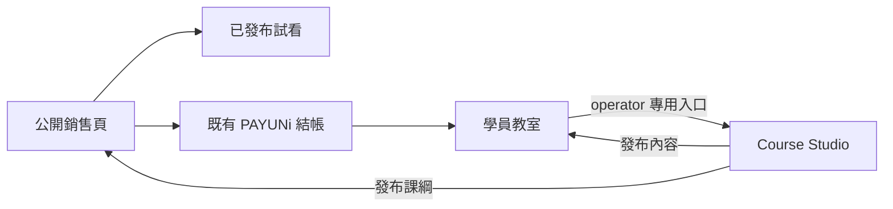

# Design: 電馭學院互動學習系統

## 1. 已定案邊界

- 品牌固定為「電馭學院（StartKiter Academy）」，不可混用其他學院名稱。
- Demo 是交互參考，不是程式來源。Demo 中的 Font Awesome、Emoji、icon font、假資料陣列、直接 `innerHTML` 與裸露原生播放器不會進入正式產品。
- 課程內容是站級資料，學習進度是使用者私有資料；本 change 不引入 Organization 多租戶。
- 完整播放仍以 `Order.courseAccess=true` 為準。試看只允許已發布且 `isFreePreview=true` 的單元，且不會放寬其他單元。
- operator 身分只由既有 `ADMIN_EMAIL` 規則決定。Course Studio 的每個頁面和 oRPC mutation 都要做伺服器端 fail-closed 判定。
- AI 助教本 change 不使用 tools。它只可讀取目前已授權 lesson 的已發布內容與 AI context，不能持有跨 lesson 記憶、不能寫資料。

## 2. 三門戶流程



公開銷售頁由 `apps/marketing` 提供品牌、Hero、Fluent 試看區、已發布課綱、講師／FAQ 內容與唯一 PAYUNi 結帳 CTA。它讀取已發布資料和既有單一 SKU 價格，不自行複製結帳規則。

學員教室由 `apps/saas` 提供。operator 才看得見 32px 黑底 Admin Bar 與回 Studio 的 SVG action；一般學員不會得到 Studio 路由入口。

## 3. 四個 Mount Point 與跨 change 契約

每個課程功能必須同時能對應下列四處，使用同一 `course` module id：

| Mount Point | SSOT | 本 change 的責任 |
| --- | --- | --- |
| 資料 | `packages/database/prisma/schema.prisma` | 課程、章節、單元、進度與 Studio 導覽排列的模型及 migration |
| API | `packages/api/modules/course/` | oRPC reader、operator mutation、所有 ownership／權限／排序驗證 |
| UI | `apps/saas/app/.../course/` | 學員教室、Studio、試看導流與 SVG 可存取 UI |
| 模組註冊 | `config/modules.ts` | 模組名稱、SVG icon key、導航群組、順序、enabled 與四處掛載描述 |

`config/modules.ts` 是本 change 的 module registration SSOT。若 `platform-shell-plugin-architecture` 的 `packages/platform` registry 已存在，它只能由 `config/modules.ts` 匯入或轉接；同一個 module 的 enabled 狀態、路由與導航資訊不可分別維護。

在寫程式前，須以 `spectra analyze` 與兩張 change 的資料表對照完成一致性 gate。若 platform change 的 generic block editor non-goal 與本 change 相撞，以「課程專屬 allowlisted MDX 欄位與預覽」為準，不實作泛用編輯器。

## 4. 資料模型與完整性

課程資料使用 Prisma migration 新增，不直接手改資料庫。最小模型與關聯如下：

```text
Course 1 --- n Chapter 1 --- n Lesson
User   1 --- n LessonProgress n --- 1 Lesson
StudioFolder 1 --- n StudioFolderItem --- 1 ModuleDescriptor(course)
User   1 --- n StudioFolderCollapseState n --- 1 StudioFolder
```

| 模型 | 關鍵欄位與不變量 |
| --- | --- |
| Course | `slug` 唯一、標題、公開銷售內容、`status`、`publishedAt`；只有已發布資料可進公開頁 |
| Chapter | `courseId`、標題、`position`；同一課程內 position 必須可決定排序 |
| Lesson | `chapterId`、標題、描述、`position`、`isFreePreview`、`mediaProvider`、`mediaUrl`、`durationSeconds`、`contentMdx`、`aiContext`、發布狀態 |
| LessonProgress | `userId`、`lessonId`、`completedAt`、可選 completed block ids；`userId + lessonId` 唯一，完成請求必須 idempotent |
| StudioFolder / StudioFolderItem | 全站 operator 可管理的資料夾名稱與 module item 排列；item 指向 module id，不複製 module descriptor |
| StudioFolderCollapseState | 每位 operator 自己的收折偏好；收折不得更改資料夾名稱、排序或目前 lesson |

所有 list reader 都必須使用 deterministic `position` 加穩定 id 排序。章節／單元的跨章節搬移與重新排序必須在單一 transaction 內重新編排，避免重複或空洞 position。刪除前 UI 必須二次確認，API 仍必須拒絕未授權或不存在的目標。

## 5. 權限與公開狀態

| 操作 | 匿名 | 已登入未購買 | 已購買 | operator |
| --- | --- | --- | --- | --- |
| 看已發布銷售頁 | 允許 | 允許 | 允許 | 允許 |
| 播放已發布試看 | 允許 | 允許 | 允許 | 允許 |
| 播放非試看完整單元 | 拒絕 | 拒絕 | 允許 | 依既有課程權限 |
| 寫自己的進度 | 拒絕 | 拒絕 | 允許 | 允許且仍只寫自己 |
| 讀取／修改 draft、AI context、課綱 | 拒絕 | 拒絕 | 拒絕 | 允許 |
| Studio 導覽／發佈／排序 | 拒絕 | 拒絕 | 拒絕 | 允許 |

不得接受 client 傳入的 userId、role、operator flag、authorId 或 lesson owner 作為授權依據。oRPC handler 一律從受保護 session 推導呼叫者，並將未登入與非 operator 分別映射為 401／403。

## 6. Fluent Player 與影音來源

`FluentPlayerShell` 是唯一的學員端與公開試看容器。它管理深色外觀、RWD 16:9 容器、播放狀態、音量、進度、字幕預留位置、keyboard focus 與 provider adapter；direct media 可在 shell 內使用底層 video element，但不得另做未套用 shell 的裸播放器。

```text
Studio URL input
  -> strict URL resolver
  -> provider adapter
  -> provider / source id / duration metadata card
  -> validated published Lesson
  -> FluentPlayerShell
```

允許來源：Bunny.net、YouTube、Vimeo、HTTPS MP4、HTTPS HLS。resolver 必須先驗證 HTTPS、供應商 host／檔案格式與可抽取識別碼；unknown URL、HTTP URL、Cloudflare Stream 與 metadata 解析失敗都回傳可修正錯誤，不能儲存為 generic MP4。

duration 由 provider adapter 取得；若 provider 合法但暫時無法取得，Studio 顯示明確未取得狀態並禁止發布，直到可驗證的 metadata 補齊。資訊卡至少呈現 provider、source identifier、duration 與 Fluent shell 相容狀態。

## 7. 學員教室、進度與大綱

教室桌面版由可收折課綱、中央播放器／內容、可開關 AI 助教工作區組成；窄螢幕可重排但頂部進度不可消失。頂部固定顯示：

```text
完成百分比 = round(100 * 已完成已發布單元數 / 已發布單元總數)
顯示格式 = "38% · 3/8 單元"（3 / 8 的範例）
```

`LessonProgress.completedAt` 存在時，該單元顯示綠色 SVG 勾選。標記完成 API 使用 upsert；重複點擊不增加完成數。切換 lesson 或重新載入後，資料由 server reader 回讀，不能依 client counter 推測。

課綱側欄顯示章節、單元編號、時長、目前播放中狀態與完成狀態。收折／展開是非破壞性 UI 狀態，不能導致 lesson 切換、完成狀態改變或重新排序。

## 8. Studio 與發布工作流

Studio 採 WordPress 式資訊架構，不引入 WordPress：32px 黑底 operator Admin Bar、深色分組側欄、桌面收合、窄螢幕抽屜、資料夾管理與課綱編輯工作區。

單元列一律使用三個 imported SVG icon-only actions，對應編輯、預覽與刪除語義；每個按鈕都有 `aria-label`、visible tooltip、focus style。刪除 action 先開 confirmation dialog，確認後才呼叫 mutation。

Studio 允許：建立／編輯／刪除 Course、Chapter、Lesson；改 `isFreePreview`；在章節內或跨章節拖曳單元；排序章節；改名、排序、收折資料夾；編輯 allowlisted MDX、AI context 與影片 URL。preview 讀取 draft，只對 operator 可見；published reader 只在發布成功後更新公開頁與學員教室。

## 9. MDX、互動積木與 AI 助教

MDX renderer 採固定 allowlist。可用積木為 TimelineSync、ConceptCompare、MicroSandbox、WorkflowSorter、InstantQuiz、TeacherAvatar、DialogueWindow；每個 block 的 props 先以 schema 驗證，不能執行任意 JSX、HTML、script、event handler 或遠端 component import。

架構邊界明確區分：`TeacherAvatar` 與 `DialogueWindow` 為嵌入在**講義內容 (MDX Content) 中由講師預先編排的教學引導與對照積木**；而「隨課 AI 助教」則是獨立常駐在右側的**即時問答側欄面板 (In-Lesson AI Tutor Panel)**，由伺服器端注入本節講義 Context 進行動態答疑，兩者元件實作與資料流完全解耦、互不混淆。

積木完成只會送出具有 lesson id、block id 的受保護事件；server 依 session、已授權 lesson 與 allowlisted block id 確認後才更新該使用者的 progress。InstantQuiz 的正確／錯誤狀態使用文字與 SVG，不以 pictographic character 表意。

AI Tutor request 只包含 server 派生的 current lesson id、已發布 lesson content、該 lesson 的 AI context 與已驗證 messages。輸入與輸出採安全 renderer；禁止直接插入 `innerHTML`。provider 缺設定、moderation／模型錯誤、或 lesson 不可讀時，回傳白話失敗狀態且不改變進度。

## 10. 時間碼同步與可存取性

時間碼統一正規化為非負整數秒。播放器 adapter 發出 current time，TimelineSync 依開始／結束秒決定 active block；使用者點時間碼時 adapter seek 到該秒數。自動捲動只在使用者未選擇 reduced motion 時執行，且不能搶走鍵盤焦點。

互動系統的 shipped UI 一律使用 shared design-system control。圖示規則由 `design-system` delta 強制：不載入 icon font、不得輸出 pictographic Unicode icon、不得以 `<i>` 當圖示。所有 keyboard action、進度條、dialog、拖曳排序與播放器控制都要有語義、focus 可見性和對應測試。

## 11. 風險與對策

| 風險 | 對策 |
| --- | --- |
| platform change 與白皮書的 registry 路徑不同 | 首 Wave 做 cross-change consistency gate，固定 `config/modules.ts` 為唯一註冊來源 |
| Demo 將未知 URL 當 direct media | resolver fail-closed，metadata 不完整不可發布 |
| client 偽造完成、排序或 operator | 全部由 oRPC session、transaction、unique constraint 與 role middleware 驗證 |
| MDX／AI 輸入造成 XSS | allowlist、schema validation、safe renderer，禁止 raw HTML／script／innerHTML |
| 進度顯示漂移 | 由 `LessonProgress` 和已發布 lesson 集合推導，不持久化百分比 |
| 互動積木與播放器已存在的 primitives 被誤判完成 | 先寫紅燈整合測試，再以真 adapter 事件與 browser 行為驗收 |

## 12. 驗證策略

- 單元：URL resolver、provider adapter、timecode、MDX props、進度公式、排序 transaction、ownership、operator middleware、SVG icon source scan。
- 整合：oRPC course router 的 401／403、試看、完整播放、發布、progress upsert、URL metadata、draft preview。
- Browser：銷售頁到試看、付費教室進度更新、側欄收折、Studio 拖曳後重新載入、SVG action accessibility、窄螢幕進度仍可見。
- Artifact：每個 requirement 對應 task；`spectra analyze interactive-learning-system` 0 issue；`spectra validate interactive-learning-system --strict` 0 error。
